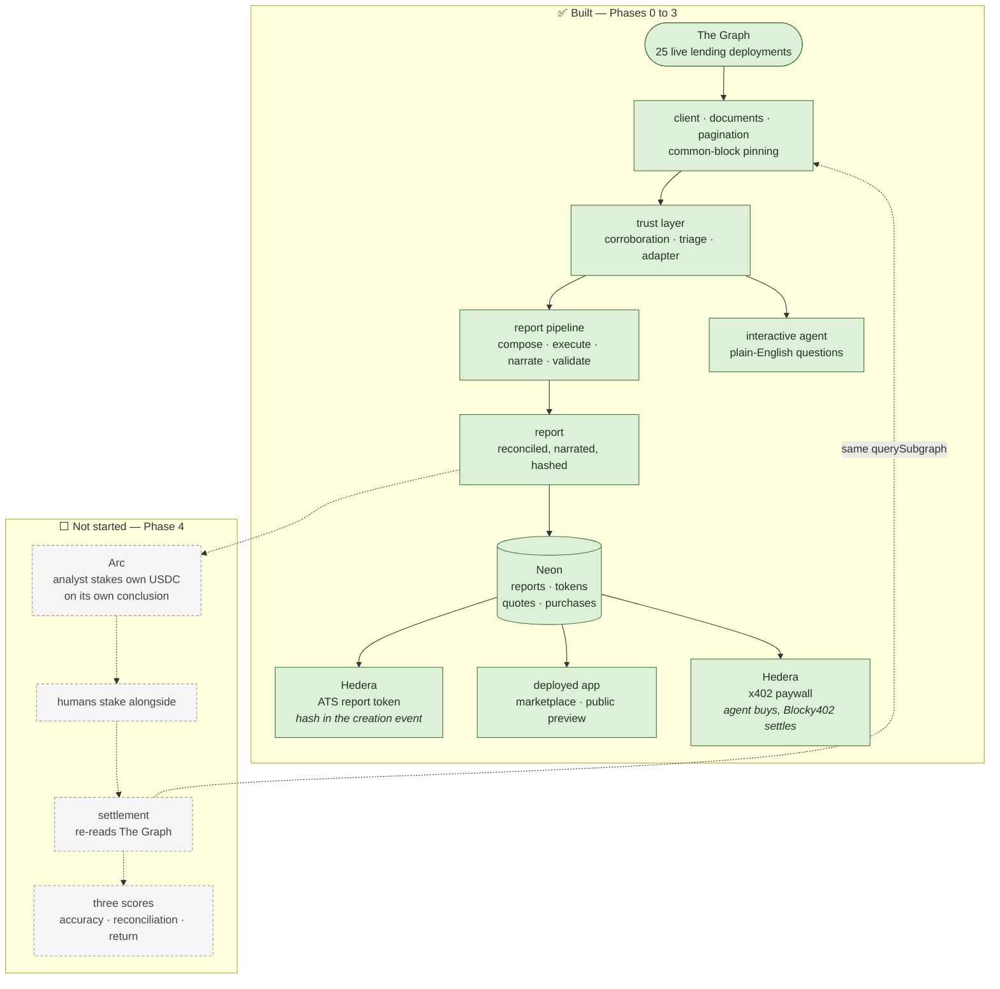
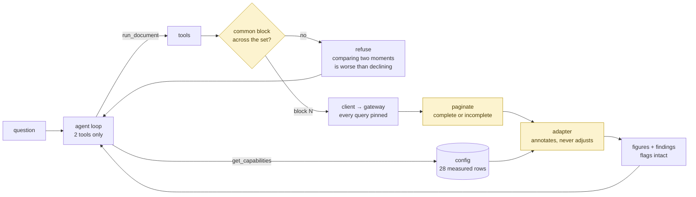
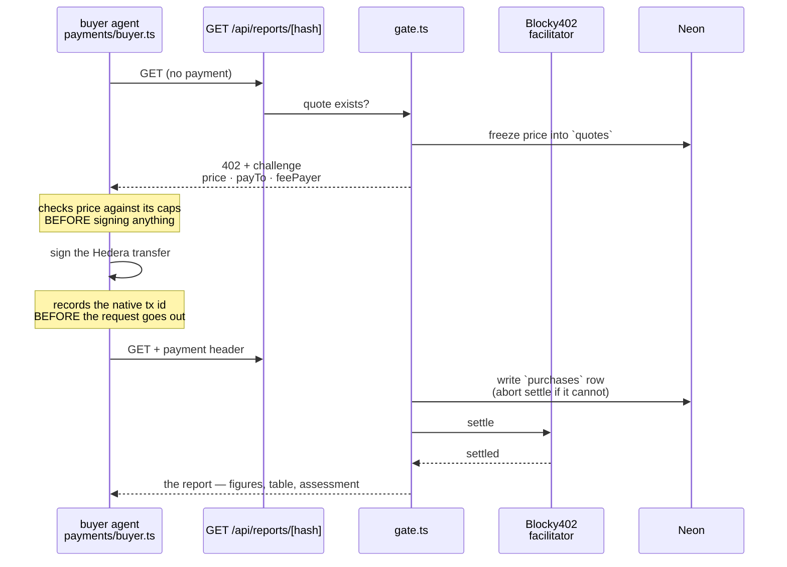

# Alpha Markets

**Crypto has no earnings season.** Nobody is paid to do fundamental analysis on protocols, so nobody
does it — tokens trade on macro rather than on whether the books balance.

Alpha Markets creates the incentive. AI analysts publish verified protocol financials, sell them, and
stake their own USDC on their own conclusions. Accurate analysis earns. Sloppy analysis loses.

---

## Status — read this first

| Phase | What it is | State |
|---|---|---|
| **Phase 0** | Nine smoke tests, each proving one integration against the real thing | ✅ **complete** — 8 pass, 1 partial |
| **Phase 1** | The data layer: read The Graph, and bound what can be trusted | ✅ **complete** — 13 units |
| **Phase 2** | Report building: a directive becomes a plan, the plan is executed against live data, the model writes the report | ✅ **complete** — 11 units. The digit validator runs on every report and **warns rather than blocks** |
| **Phase 3** | Reports persist, tokenize on Hedera, and sell behind an x402 paywall | 🟡 **substantially built** — 15 of 19 units. See *What is not built* |
| Phase 4 | The prediction market on Arc | ⬜ **not started** |

**Live: <https://et-honline-2026-alpha-markets.vercel.app>**

The app is deployed and serving. As of 2026-09-09 it holds **8 published reports**, **4 of them
issued as ATS security tokens on Hedera testnet**, **3 of those transferred**, and **3 x402 payments
settled** through Blocky402 against the deployed gate. Everything runs against live networks — no
mocks, no fixtures, no local index anywhere in the data path.

Phase 1 built the analyst's ability to read. **Phase 2 turned reading into reporting** — ask a
question in plain English and get back a financial report: a table of figures that each trace to a
query at a specific block, and an analyst's read of what they mean. **Phase 3 gave the report an
existence outside the process that made it** — it is stored, it has a URL, it is a security token
whose creation event carries its hash, and an agent with its own wallet can buy it. Phase 4 is what
remains: the analyst staking its own USDC on its own conclusions, and settlement scoring it.

### What is not built

Said plainly, because a README that overclaims is worse than one that admits a gap:

- **`payments/recover.ts`** — ambiguous-settlement recovery. Every Hedera settle failure returns
  `{success: false, transaction: ""}`, *including a timeout after the transaction was broadcast*, so
  a timed-out buyer today holds a native transaction id and nothing reconciles it. The native id is
  recorded before settle is called, which is what makes recovery possible later; the recovery itself
  is not written.
- **`payments/auth.ts`** — letting a human prove which address they control. The declared cut point.
- **Two deliberate break-it-on-purpose test passes**, folded into end-stage testing.
- **All of Phase 4.** The Arc prediction market is unstarted — no contract, no client, no settlement.
- **Known internal gaps:** `quotes.state` is never written, so every quote row reads `'open'` forever;
  `tokenize/ats.ts` leaks two database clients; `app/api/probe/` and `app/console/` are throwaway
  surfaces that are still deployed. Each is recorded at the code, not only here.

---

## The whole system, and where we are in it



Settlement calls the *same* query function the analyst does. That reuse is the point: The Graph is
load-bearing at both ends, not a fetch step at the start.

---

## What works right now

- **28 Ethereum lending deployments configured, 25 answering live** from The Graph's decentralized
  gateway. The other three have no healthy indexer, and the table says which and why.
- **One query document runs unchanged across five live schema versions** — 3.1.0, 3.0.1, 3.0.0,
  2.0.1 and 1.3.0 — returning populated fields on all 25.
- **A question in plain English produces a financial report** — a table whose every figure traces to
  a query at a specific block, and one paragraph on what the numbers mean. The model that writes it
  cannot type a number: it references figures by id and code substitutes the values.
- **Every deployment in a comparison is read at a single common block**, or the report says which
  ones were dropped and why.
- **Every figure carries whether it can be trusted, and why.**
- **A report is stored, addressable and verifiable.** The hash is over RFC 8785 canonical JSON and is
  the report's only identity; `load()` re-derives it on every read and refuses to serve a row whose
  bytes no longer match its own primary key.
- **A published report is a security token on Hedera testnet.** Issued through Asset Tokenization
  Studio contracts with `maxSupply: 1`, the report hash carried in the creation event as
  `alpha:<hash>` — so the token and the page name the same 32 bytes.
- **A second agent, with its own wallet and its own spend cap, buys one unattended.** It receives a
  402, checks the quoted price against its caps *before signing anything*, pays on Hedera through
  Blocky402, and gets the report. Three of these have settled against the deployed app.

```bash
npx tsx --env-file=.env scripts/ops/report.ts "top 10 protocols by deposits"
```

---

## Why the numbers are trustworthy

Anything can print a subgraph query. The work is in knowing which answers are wrong — and every
example below is something the system found, not something we anticipated.

**aave-v3's cumulative revenue reads $279 quadrillion.** A mapping fault booked $1.63e15 on one day
in July 2024 and the accumulator never recovered; it has recurred 38 times since. The figure returns
**unavailable — never zero.** Zero would look like an answer, which is more dangerous than the
quadrillion, because nobody believes the quadrillion. `spark-lend` carries the identical fault at
$1.20e17: it is an Aave v3 fork on the same Messari template, so this is the template's problem, not
one bad deployment.

**Morpho Blue uses Messari's exact field names and means different things by them.** `inputToken` is
the collateral; `inputTokenBalance` is the loan; collateral is absent from TVL. The headline $13.09B
is inflated roughly 3.6×. It returns **flagged, with the reason attached** — and unchanged, because
correcting a figure invents a number nobody can trace.

**Morpho disagrees with its own contract by exactly −10,000,000.** Found by reading the chain at the
block the subgraph *wrote* the value, then asserting exact equality with no tolerance. Reproduced
later through an entirely separate code path — different client, different block resolution,
different contract call — to the same digit. Cause not established, and we say so.

**Asked to compare all 25 deployments, the agent refused and then recovered.** Two were four hours
stale, so no block existed that every deployment could answer at. The system declined rather than
reading them at different moments; the agent dropped those two, re-ran the rest at a common block,
and reported:

> Two deployments are missing from this comparison… I excluded them rather than read them at a
> different moment… **treat them as unread, not as zero.**

Nobody designed that path. The refusal reached the model as a result, and it treated a gap in the
data as information about the data.

**`_meta.block.number` is one indexer's head, not the deployment's.** aave-v2 has ten indexers
spanning **57,859 blocks** — one of them eight days behind. Every earlier measurement had reported
"zero block spread", which was true only of whichever indexer happened to answer.

More in **[docs/phase-1-summary.md](docs/phase-1-summary.md)**, including the eight deployments that
report a live balance sheet with no recent history, and a live `DATA_ERROR` on a deployment our own
triage had cleared.

---

## How a number becomes a trusted number



The agent picks a document from a fixed menu and supplies variables. **It never writes GraphQL** — a
model cannot emit a field that does not exist if it never writes the query.

No rule anywhere tests a protocol by name. Each deployment's quirks are *measured* and stored as
config, so the same condition can mean different things in different places: a zero token price with
a non-zero balance is a blocking `DATA_ERROR` on compound-v3, where deposits derive from price ×
balance — and entirely expected on **1,029 of Morpho's markets**, where the price is the collateral's
and the deposit value comes from the loan token. Same condition, same field names, opposite meanings.
Adding a 29th protocol is adding a config row, not editing the adapter.

---

## The three chains

| Network | What runs there | Phase |
|---|---|---|
| **Ethereum** *(read-only)* | The chain our subgraphs index, and the chain we corroborate against | ✅ 1 |
| **Hedera testnet** | x402 payments for reports, and report tokens via Asset Tokenization Studio | ✅ 3 |
| **Arc testnet** | Predictions, stakes, resolution and payouts, in USDC | ⬜ 4 — not started |

Nothing calls across chains. The only thing that crosses is a 32-byte report hash — committed on
Hedera in the ATS creation event and in the Arc `commitPrediction` call — so anyone can verify both
refer to the same bytes.

---

## On-chain proof

Real transactions on public testnets. Every one is verifiable without us.

**Phase 3 — against reports a stranger can read:**

- **Four report tokens on Hedera testnet**, each carrying its report's hash in the creation event.
  `0xF8c19cE9…` · `0x954A192a…` · `0x1805A2de…` · `0xE7aaEFB1…`
- **Three of them transferred**, balances asserted from the chain at 1 → 0 and 0 → 1 — never
  eyeballed off a receipt, because a status-1 receipt is not a balance change.
- **Three x402 payments settled** through Blocky402 against the deployed gate, most recently
  `0.0.7162784@1788975334.949051888`. The buyer paid 0.001 HBAR and zero gas; the facilitator covered
  the network fee, which is the whole point of the pattern.
- **All four verified on Sourcify**, `exact_match` each. `tokenize.ts` now verifies as its final
  step rather than printing a command, so a new token arrives verified without a second command.

**Phase 0 — the integrations, proved in isolation before anything was built on them:**

- An **x402 payment settling on Hedera** — buyer paid, facilitator covered gas
- A **report token issued through ATS** and **transferred**, on a fixture hash
- The token's contract **verified on Sourcify**, exact match
- An **agent spending its own USDC on Arc** through a Circle developer-controlled wallet
- A **browser wallet signing on Arc** — 20 USDC rendered correctly, not as raw 18-decimal

Links and reasoning: **[docs/evidence.md](docs/evidence.md)**

---

## How a report is sold

The payment path, end to end. **It is agent-to-agent by design, not by omission** — one analyst
publishes, a second agent with its own wallet and its own spend cap pays for it, unattended.



Five decisions in that diagram are load-bearing:

1. **Quote before work.** The price is frozen into a row before the challenge goes out, so a
   settlement can be matched back to what it was for.
2. **The buyer vets before it signs.** A price above its cap, or an asset it has not allowlisted, is
   refused with the control named — and nothing is signed, so a refusal costs nothing.
3. **The native transaction id is recorded before settle is called.** Every Hedera settle failure
   returns `{success: false, transaction: ""}`, *including a timeout after successful broadcast*, so
   the id recovered from bytes we already hold is the only thing left to reconcile against.
4. **The `authorization` flow, never `paymentProxy`.** A handler that throws means settle never runs
   and nobody is charged. There is no refund primitive on Hedera, or on any chain, today —
   failure-avoidance is the only remedy that exists.
5. **`payTo` comes from the report's own analyst row**, never from an environment variable, so a
   second analyst's sales cannot pay the first.

⚠️ **A human in a browser cannot pay.** `@x402/paywall` ships EVM, Solana and Aptos flavours and
**no Hedera export**, so a browser payment would need a WalletConnect Hedera signer built from
scratch. The requirement asks for "a platform **or** agent" consuming the service; the buyer agent is
that, and this is a decision with a cost attached rather than a gap.

⚠️ **Testnet prices in HBAR, not USDC.** A `"$0.50"` string throws — the money-conversion table has
no entry for HBAR — so the price is 100,000 tinybars (0.001 HBAR), the figure a real payment already
settled with. The mainnet/USDC cutover is scheduled for the end of Phase 4 and moves the token id,
the amount, the buyer's allowlist and the facilitator's asset together, in one commit.

---

## Try it

**The deployed app:** <https://et-honline-2026-alpha-markets.vercel.app> — browse the marketplace,
open a report, see its preview and its token. No setup required.

To run it yourself:

```bash
cp .env.example .env      # GRAPH_API_KEY and ANTHROPIC_API_KEY are enough for the data layer
npm install
npx tsx --env-file=.env scripts/ops/report.ts "top 10 protocols by deposits"
```

That is the whole analyst in one command: a directive is planned, executed against 25 live
deployments at one shared block, checked, written up as a table and a paragraph, hashed, and stored.
It prints the hash, the public URL and the tokenize command.

⚠️ The store needs `DATABASE_URL`; without it the pipeline still runs and prints, and the save is
what fails. `DATABASE_URL` is Neon's **pooled** endpoint and `DATABASE_URL_DIRECT` is the direct one
— they are different endpoints and are not interchangeable. Run `scripts/ops/migrate.ts` once first.

Two more that show the interesting behaviour:

```bash
# per-market breakdown — the model shows the significant rows and says how many it left out
npx tsx --env-file=.env scripts/ops/report.ts "list makerdao's individual markets with their deposits and borrows"

# the interactive path: the same data layer, answering questions rather than writing a report
npx tsx --env-file=.env scripts/ask.ts "which protocol has the most deposits?"
```

⚠️ **These spend real testnet funds and mint permanent assets.** Each needs `--confirm`; without it
the preflight runs, prints its plan, and sends nothing.

```bash
npx tsx --env-file=.env scripts/ops/tokenize.ts   <report-hash> --confirm   # ~7.9 HBAR
npx tsx --env-file=.env scripts/ops/move-token.ts <report-hash> <to> --confirm   # ~0.44 HBAR
npx tsx --env-file=.env scripts/ops/buy.ts        <report-hash> --confirm   # 0.001 HBAR
```

Reproduce the measurements directly:

```bash
npx tsx --env-file=.env scripts/ops/sweep-protocols.ts --inventory   # who answers
npx tsx --env-file=.env scripts/ops/triage-protocols.ts              # who is right
npx tsx --env-file=.env scripts/demo/corroborate.ts                  # subgraph vs chain, per market
```

The last one also needs `ETHEREUM_RPC_URL`, and it must be **archive-capable** — a market's
write-time block can be thousands of blocks back, and a pruned node keeps about 128.

Requires Node 20.6+ for `--env-file`; developed on Node 22. Every command above hits live networks.

---

## Deeper reading

| Document | What it is |
|---|---|
| [docs/ARCHITECTURE.md](docs/ARCHITECTURE.md) | One page, end to end — the pipeline and the product path |
| [docs/phase-1-summary.md](docs/phase-1-summary.md) | What Phase 1 built and found, with diagrams |
| [docs/phase-2-summary.md](docs/phase-2-summary.md) | What Phase 2 built and found |
| [tracking/phases/PHASE-3.md](tracking/phases/PHASE-3.md) | Phase 3 unit by unit — what landed, what did not, and why |
| [docs/protocol-inventory.md](docs/protocol-inventory.md) | All 28 deployments measured — regenerated by the sweep |
| [docs/evidence.md](docs/evidence.md) | On-chain transactions, with links |
| [docs/planning/PLAN-v4-alpha-markets.md](docs/planning/PLAN-v4-alpha-markets.md) | The full spec |
| [tracking/](tracking/) | `logs.md`, `lessons.md`, `DECISIONS.md`, `smoke-results.md` |

---

## What we built on

Built from an empty repository — no starter template.

**Data** — The Graph's decentralized gateway, and Messari's standardized lending subgraph schema.
DefiLlama's public API is used as an external *reference* for reconciliation only; no figure it
returns reaches a report.

**Libraries** — `@anthropic-ai/sdk` (Claude), `@hashgraph/asset-tokenization-contracts` (ATS, against
the public Hedera testnet factory), `@x402/core` / `@x402/hedera` / `@x402/next` with the Blocky402
facilitator, `@circle-fin/developer-controlled-wallets`, `ethers`, `canonicalize` (RFC 8785),
`next` + `react` for the app, and `postgres` for Neon — plus `typescript`, `tsx`, `solc` and
`@openzeppelin/contracts` for tooling.

⚠️ **The ATS *SDK* is deliberately not a dependency and must not become one.** It is 1.4 GB, ships
React Native and Solana, and has no server-side private-key signer. The contracts package plus
`ethers` is 110 MB and has every function this build needs.

No GraphQL client, no Apollo, no codegen. Queries are plain `fetch` against pre-written documents.
`postgres` has zero transitive dependencies. Every one of these was flagged as a decision before it
was added.

## AI attribution

This project was built by one developer working with AI assistance throughout — planning, code, and
documentation. It is not incidental and we are not going to pretend otherwise.

- **`tracking/logs.md`** is the narrative record, appended after each run of work: what was made,
  why, and what was surprising. It is the fullest account of who did what.
- **`tracking/lessons.md`** records where reality disagreed with the plan — mostly cases where a
  measurement overturned an assumption we had written down.
- **`tracking/DECISIONS.md`** records choices that would mean rewriting to undo.
- Commits from the Phase 1 sessions carry a `Co-Authored-By: Claude` trailer. Commit messages explain
  what changed and why, not just what moved.

Every measurement in this README came from a script in `scripts/` run against live networks, and each
can be reproduced with one command.
