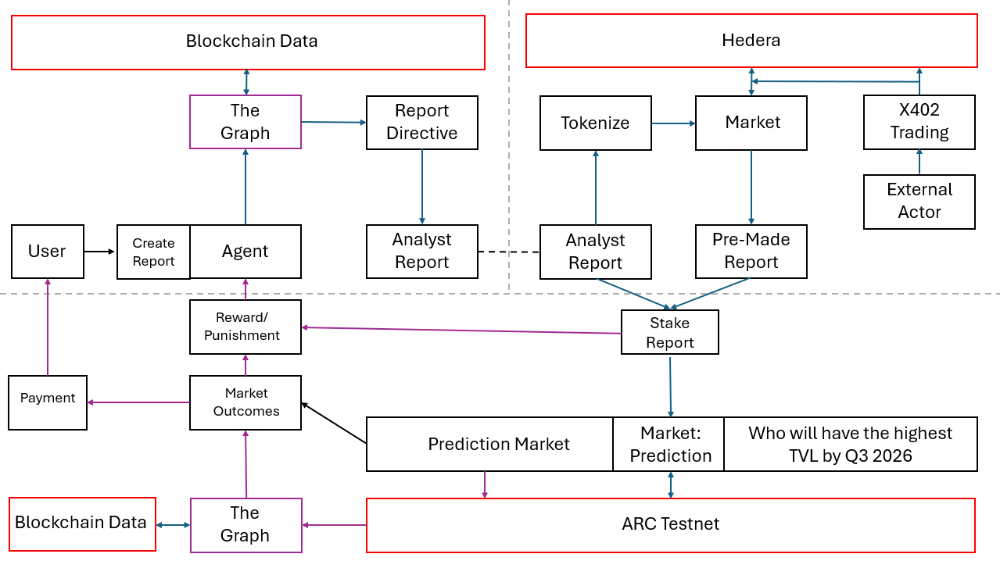

# Alpha Markets

**Crypto has no earnings season.** Nobody is paid to do fundamental analysis on DeFi protocols, so
nobody does it.

Alpha Markets is an agent economy for DeFi fundamental analysis, with a prediction market that rewards
accurate reporting. An AI analyst writes verified financial reports from on-chain data, tokenizes
them, sells them to other agents, and stakes its own USDC on what they conclude. Settlement grades
the analyst, and the grades shape its next report.

**Live app:** <https://et-honline-2026-alpha-markets.vercel.app> · **Repo:**
<https://github.com/DhruPtel/ETHonline-2026-Alpha-Markets> · **Networks:** Hedera testnet, Arc
testnet, The Graph (live gateway), Ethereum mainnet (read-only)



<sub>The concept diagram. The example question is illustrative: a market as built asks whether one
deployment's metric is above a threshold on one named day. The as-built diagrams are in
[docs/ARCHITECTURE.md](docs/ARCHITECTURE.md).</sub>

## Contents

1. [What it is](#what-it-is)
2. [Try it without cloning](#try-it-without-cloning)
3. [Track requirements](#track-requirements)
   - [The Graph: standardization](#the-graph-standardization)
   - [The Graph: AI tooling](#the-graph-ai-tooling)
   - [Hedera: agentic payments](#hedera-agentic-payments)
   - [Hedera: tokenization](#hedera-tokenization)
   - [Arc](#arc)
4. [What is not built](#what-is-not-built)
5. [Run it locally](#run-it-locally)
6. [Repository map](#repository-map)
7. [Built with](#built-with)
8. [AI attribution](#ai-attribution)

---

## What it is

The loop has seven steps. Each one is a real system running against a live network.

| | step | what happens | code |
|---|---|---|---|
| 1 | **Research** | The analyst turns a plain-English directive into a financial report on Ethereum lending protocols, read live from The Graph. Every figure traces to a query at a named block. The model never types a number: it cites figures by id and code fills them in. | `src/agent/`, `src/graph/` |
| 2 | **Tokenize** | The report is hashed (RFC 8785 canonical JSON, then SHA-256) and issued as a one-of-one security token through Hedera's Asset Tokenization Studio. The hash sits in the token's creation event. | `src/domain/`, `src/tokenize/` |
| 3 | **Sell** | The full report sits behind an x402 paywall on Hedera. A buyer agent with its own account and spend caps pays 0.001 HBAR through the Blocky402 facilitator. | `src/payments/` |
| 4 | **Stake** | The analyst commits the report's hash to a side of a prediction market on Arc, staking its own USDC from a Circle developer-controlled wallet. Anyone can stake alongside from a browser wallet. | `contracts/`, `src/arc/` |
| 5 | **Settle** | After the day in question, settlement re-reads the same Graph data, stores the evidence, and puts the outcome and the evidence hash on chain. If no outcome exists, anyone voids the market after the deadline. | `src/arc/settle.ts`, `resolve.ts` |
| 6 | **Grade** | Each claim is scored right, wrong or void. | `src/arc/score.ts` |
| 7 | **Feed back** | The analyst's recent grades are written into the prompt that plans its next report. | `src/agent/context.ts` |

**Nothing bridges Hedera and Arc.** Both chains carry the same 32-byte report hash, and anyone can
check both ([how](docs/ARCHITECTURE.md#3--one-hash-two-chains)).

**Why the numbers can be trusted is most of the work.** The data layer reads 28 lending deployments
that share Messari's standardized schema. It pins comparisons to a single block or refuses. It
corroborates figures against Ethereum at the block they were written. And it flags, never corrects,
what cannot be trusted. Examples:

- aave-v3's cumulative revenue reads $2.79e17 because of a template fault. The system reports it as
  unavailable.
- Morpho Blue uses the standard field names for different quantities. Its figures are flagged, with
  the reason attached.

More in [`docs/phase-1-summary.md`](docs/phase-1-summary.md).

---

## Try it without cloning

Everything below is on the deployed app. ⚠️ **Several buttons spend real testnet funds from our
accounts, not yours.** That is by design for a demo, and each one is capped or costs very little.

| page | what to do there |
|---|---|
| [`/`](https://et-honline-2026-alpha-markets.vercel.app/) — Reports | Browse published reports. Each card shows its token (ISIN, with a HashScan link) and any grades. |
| [`/report/[hash]`](https://et-honline-2026-alpha-markets.vercel.app/report/2253e57e9173f6a8d21944905ba13b2705464b6410bb201707ccef2ec11aac69) | The public preview: directive, analyst, block, full hash, coverage counts, and **The Graph deployment and block it read**. **Buy this read** runs our buyer agent on the server: it pays a real 0.001 HBAR x402 payment and shows the full report with its settlement receipt. |
| [`/console`](https://et-honline-2026-alpha-markets.vercel.app/console) — Console | **Ask Atlas**: type a directive and watch the pipeline run against live Graph data. **Source data** runs one live query and shows its evidence record. **Tokenize** (about 7.7 HBAR) and **Publish** take a report on to Hedera and the marketplace. ⚠️ The console is currently unlocked. |
| [`/markets`](https://et-honline-2026-alpha-markets.vercel.app/markets) — Markets | Open forecasts, plus the newest demo market. **Start a demo market** opens a new one on Arc, paid by the analyst, with at most six open at once. |
| `/markets/[id]` | **On a forecast:** with no claim yet, pick a report whose deployment matches the question (others are refused before anything spends). **Review this position**, then confirm; the analyst commits with its own USDC and no wallet connects. Once a claim exists, stake behind it from MetaMask on Arc testnet. **On a demo market:** during its 150-second staking window, commit your own claim from a browser wallet; then **Reveal answer** reads The Graph and resolves on chain. |
| [`/analyst`](https://et-honline-2026-alpha-markets.vercel.app/analyst) — Analyst | The graded record, the tokens the analyst holds, and **the exact text** its next report's planner will read. |
| [`/api/health`](https://et-honline-2026-alpha-markets.vercel.app/api/health) | JSON: whether Blocky402 still advertises our network and fee payer, and the ATS resolver's status. |

To stake yourself, you need Arc testnet USDC in a browser wallet. Use
[faucet.circle.com](https://faucet.circle.com) and choose Arc Testnet. The page adds the Arc network
to MetaMask for you.

---

## Track requirements

Each row says what the requirement asks, where it is met, and an artifact you can check. Every
transaction below was re-read from Mirror Node or arcscan's API on 2026-09-13.

### The Graph: standardization

| asks | where it is met | check it |
|---|---|---|
| Build meaningfully on a standardized schema | **28 Ethereum lending deployments on Messari's standardized lending schema**, across five live schema versions (3.1.0, 3.0.1, 3.0.0, 2.0.1, 1.3.0). Three query documents run unchanged across all of them, with no version dispatch. Quirks are measured per deployment as config rows. | [`src/config/protocols.ts`](src/config/protocols.ts), [`src/graph/queries/`](src/graph/queries/), [`docs/protocol-inventory.md`](docs/protocol-inventory.md) |
| …or compose two or more Graph products | ⚠️ **Not claimed.** The build reads subgraphs only. Substreams and the Subgraph MCP were researched ([`docs/research/`](docs/research/)) but not used. We qualify through the standardized schema. | — |
| Live data from a Graph provider | [`src/graph/client.ts`](src/graph/client.ts) queries `gateway.thegraph.com` on every request, with no cache. Every report records the deployment and block it read. | Any report page, section "The Graph / this report's read". `/console` → Source data runs a live query. |
| More than one subgraph | Reports compare deployments at a common block ([`src/graph/blockwindow.ts`](src/graph/blockwindow.ts)). Settlement reads whichever deployment a market names. | [A report reading six deployments at block 25,941,210](https://et-honline-2026-alpha-markets.vercel.app/report/348482a52687dac38c530ea7203073b76c9c7676d77fe66ceea4c55b5c8a9b95) |
| Make the standards leverage clear | **Easier because of the schema:** one document per question; a new deployment is a config row; side-by-side rankings at one block; markets on any deployment with no per-protocol settlement code. **Not solved by the schema:** shared field names are not shared meanings, so figures are annotated rather than trusted. | [`src/graph/README.md`](src/graph/README.md); `npx tsx --env-file=.env scripts/demo/documents.ts` runs every document against one deployment per schema version |

### The Graph: AI tooling

| asks | where it is met | check it |
|---|---|---|
| The Graph is load-bearing, as the agent's blockchain data | Every figure enters through `src/graph/client.ts`. The agent's market side is decided from a Graph read ([`src/arc/market.ts`](src/arc/market.ts) `decideSide`). Settlement re-reads The Graph to resolve ([`src/arc/settle.ts`](src/arc/settle.ts)). | [`/markets/13`](https://et-honline-2026-alpha-markets.vercel.app/markets/13): "Resolved TRUE … by re-reading the snapshot" |
| Live data via a Subgraph Studio API key | `GRAPH_API_KEY` goes into the gateway URL in `client.ts` | [`.env.example`](.env.example) |
| Meaningful work: reasoning, decisions, automation, natural language | **Compose:** a directive becomes a plan choosing deployments and documents; it never writes GraphQL. **Execute:** a common block or a refusal, with corroboration against Ethereum. **Narrate:** the model cites figures by id and cannot type one. **Feed back:** graded claims shape the next plan. | `/console` → Ask Atlas; [`/analyst`](https://et-honline-2026-alpha-markets.vercel.app/analyst) context block; `scripts/ask.ts`; [`src/agent/README.md`](src/agent/README.md) |
| Open source, with a README judges can run | Public repository; [Run it locally](#run-it-locally) | ⚠️ **No `LICENSE` file yet.** |

### Hedera: agentic payments

| asks | where it is met | check it |
|---|---|---|
| A live x402-gated service on Hedera, settled through Blocky402 | `GET /api/reports/[hash]` on the deployed app. [`src/payments/gate.ts`](src/payments/gate.ts) wraps it with `withX402`; [`src/payments/server.ts`](src/payments/server.ts) sets network `hedera:testnet`, facilitator `api.testnet.blocky402.com` and fee payer `0.0.7162784`. The price is 100,000 tinybars. | [`/api/health`](https://et-honline-2026-alpha-markets.vercel.app/api/health): `advertisesNetwork: true`, `feePayerMatches: true` |
| An agent completing at least one real paid request end to end | [`src/payments/buyer.ts`](src/payments/buyer.ts) is an agent with its own account (`0.0.10387696`). It vets the price against its caps before signing, pays, and receives the report. It is run by [`scripts/ops/buy.ts`](scripts/ops/buy.ts) and by `POST /api/buy` (the **Buy this read** button). **16 settled purchases** as of 2026-09-13. | First against the deployed gate: [`0.0.7162784@1788908586.639187830`](https://hashscan.io/testnet/transaction/0.0.7162784@1788908586.639187830) ([Mirror](https://testnet.mirrornode.hedera.com/api/v1/transactions/0.0.7162784-1788908586-639187830)). Latest: [`0.0.7162784@1789282473.788763534`](https://hashscan.io/testnet/transaction/0.0.7162784@1789282473.788763534) ([Mirror](https://testnet.mirrornode.hedera.com/api/v1/transactions/0.0.7162784-1789282473-788763534)). Both are `SUCCESS`: buyer −100,000 tinybars, analyst +100,000. The transaction id belongs to the facilitator, which paid the fee. |
| Public repo with setup, architecture and the payment flow | This README; the payment sequence in [`docs/ARCHITECTURE.md` §4](docs/ARCHITECTURE.md#4--hedera) and [`src/payments/README.md`](src/payments/README.md) | — |

⚠️ **Limits:**
- Every purchase so far came from our own buyer account.
- A human cannot pay in a browser, because `@x402` ships no Hedera paywall.
- Testnet prices are in HBAR, not USDC.

### Hedera: tokenization

| asks | where it is met | check it |
|---|---|---|
| Use Asset Tokenization Studio to issue a tokenized asset | [`src/tokenize/ats.ts`](src/tokenize/ats.ts) uses `@hashgraph/asset-tokenization-contracts` against ATS's public testnet factory `0.0.9213391` and resolver `0.0.9212226`. **11 report tokens** as of 2026-09-13. | `/console` → Tokenize; each tokenized report's page shows its ISIN |
| Deploy and demonstrate on Hedera testnet | Worked example, report `348482a5…`: proxy [`0xF8c19cE9…`](https://hashscan.io/testnet/contract/0xF8c19cE93Dd2E23dA3bf5d68644d028d84b1E59f), ISIN `XXR0WXU28WL2` | [Deploy tx on Mirror](https://testnet.mirrornode.hedera.com/api/v1/contracts/results/0xc09a7ec79385bfedf3f8faa355f0dccf18e752d6949dab91b783c6de45bf27c5): the logs carry `alpha:348482a5…` |
| Contracts verified on HashScan | Report tokens are verified through Sourcify, which HashScan reads, by [`scripts/ops/verify-ats.ts`](scripts/ops/verify-ats.ts). **`exact_match` for 4 of 11:** [`0xF8c19cE9…`](https://repo.sourcify.dev/296/0xF8c19cE93Dd2E23dA3bf5d68644d028d84b1E59f), [`0x954A192a…`](https://repo.sourcify.dev/296/0x954A192aC6b6Db2623De614F183e6BDb2cB8b2c2), [`0x1805A2de…`](https://repo.sourcify.dev/296/0x1805A2de801032859780BacE8Ff04a13B68E76D2), [`0xE7aaEFB1…`](https://repo.sourcify.dev/296/0xE7aaEFB168F3E87975Fee1B0c932aE42776D8c6c) | ⚠️ **The seven minted since 2026-09-12 are not yet verified.** The console route that minted them has no compiler. |
| Issuance, configuration, and at least one lifecycle operation | **Configure:** `deployEquity` with supply 1, decimals 0, hash-derived ISIN, Reg S, controllable, `alpha:<hash>`. **Grant:** `grantRole(ISSUER)`. **Issue:** `issue(analyst, 1)`. **Lifecycle:** `transfer` ([`src/tokenize/transfer.ts`](src/tokenize/transfer.ts)), with balances asserted from the chain. | Report `348482a5…`: [grantRole](https://testnet.mirrornode.hedera.com/api/v1/contracts/results/0xfc86adfd80b8c7707ae0bd6852d1a84536e3301f8228d36d592028d93f472798) · [issue](https://testnet.mirrornode.hedera.com/api/v1/contracts/results/0x38472d730c97d19a0b72b29fb66609e7c89ce630b41ad19ace024e9adf5eace7) · [transfer](https://testnet.mirrornode.hedera.com/api/v1/contracts/results/0xaf47b89c0388e60a7aeea382a54874ea82b0aef113305d46f32502499066c552) |

### Arc

| asks | where it is met | check it |
|---|---|---|
| Working frontend and backend, architecture diagram, detailed docs, public repo | The deployed app (`/markets`, `/markets/[id]`, `/analyst`) and its API routes and crons ([`app/README.md`](app/README.md)). Diagrams in [`docs/ARCHITECTURE.md`](docs/ARCHITECTURE.md). Operator detail in [`docs/arc-deployment.md`](docs/arc-deployment.md) and [`src/arc/README.md`](src/arc/README.md). | [Contract `0x003e7Cb7…8044`](https://testnet.arcscan.app/address/0x003e7Cb791257B529bb5f9F6D17A846264d48044) |
| Effective use of Circle's developer tools | The analyst's Arc account is a **Circle developer-controlled wallet**. Contract calls go through `createContractExecutionTransaction`, with idempotency keys ([`src/arc/arc.ts`](src/arc/arc.ts)). `signMessage` produces a cross-chain identity attestation ([`src/arc/identity.ts`](src/arc/identity.ts) → [`src/arc/attestation.ts`](src/arc/attestation.ts)). `getWallet` backs [`scripts/ops/verify-analyst.ts`](scripts/ops/verify-analyst.ts). Funding comes from Circle's faucet. | [Analyst wallet `0x1B7035bB…16A7`](https://testnet.arcscan.app/address/0x1B7035bBe0DA8F3bcb721863D42e1079e4A116A7) |
| The agent spending its own USDC autonomously | The analyst stakes **its own USDC** on its claims (0.01 USDC each) and pays gas for create, resolve and void from the Circle wallet, with no human signing. It picks its side from a Graph read. Two daily crons are deployed ([`vercel.json`](vercel.json)). ⚠️ **Every Arc transaction so far was started by a command or a button press. No cron-sent transaction has been evidenced yet.** | Commit with 0.01 USDC: [`0x0eb87e36…`](https://testnet.arcscan.app/tx/0x0eb87e3672a1c7205186d66479fe840f83cf450c2c5bcb74852ee044bcc46ec8). Create: [`0xcd7c4187…`](https://testnet.arcscan.app/tx/0xcd7c41872e175915badea1ffe08e3b3cb86a4ae7190d40ac78c009b7fcbe0972). Both from the Circle wallet. |
| Programmable multi-step flows, including a void path | `createMarket` → `commitPrediction` → `stake` → settlement read with stored evidence → `resolve(outcome, evidenceHash)`, **or `voidMarket` after the deadline** → `claim`. See [`contracts/AlphaMarket.sol`](contracts/AlphaMarket.sol), [`src/arc/settle.ts`](src/arc/settle.ts), [`src/arc/resolve.ts`](src/arc/resolve.ts), [`app/api/cron/resolve/route.ts`](app/api/cron/resolve/route.ts). | **Void:** [`0x63086eea…`](https://testnet.arcscan.app/tx/0x63086eea9e65ffdf40387a1883cffbf94f8c6f1b43194a0181a34eaf99cfb14e), on [market #9](https://et-honline-2026-alpha-markets.vercel.app/markets/9), a day with no snapshot. **Resolve:** [`0x6ada14d7…`](https://testnet.arcscan.app/tx/0x6ada14d7a50a9014a7b2bce08926fbc53a7657233a363bc1f690534016930ee9) on market #13. **Browser-wallet commit:** [`0x99579418…`](https://testnet.arcscan.app/tx/0x99579418255a5814ce7239b9b619cfc8e228183013da40c691e810f1356f8e2b). |
| Mainnet readiness, demonstrated rather than asserted | [`docs/arc-deployment.md`](docs/arc-deployment.md) covers: every identity and permission; recovery; the provisioning order; a byte-level procedure for verifying the deployed bytecode against the committed artifact; and each mainnet-specific value as a named blank with its source. `npm run check:contract` recompiles and compares on every build (**PASS**, 2026-09-13). `/api/health` reports configuration state. | ⚠️ Not deployed to mainnet. No Circle spend cap is set. Contract source is not verified on arcscan. |

---

## What is not built

Stated plainly, because an overclaim found once discredits everything else.

**Declared cut points and next steps**

- **Identity.** There are no user accounts and no wallet sign-in. EIP-191 human identity
  (`payments/auth.ts` in the plan) was the declared cut point and was not written.
- **Multi-tenant.** There is one analyst ([`src/config/analysts.ts`](src/config/analysts.ts)) and one
  model constant. A second analyst needs its own accounts and its own market contract, because the
  resolver is immutable. This is the next step.

**Scores**

- **Trading return is null.** Nothing records the contract's `Claimed` events, so `payouts` has no
  writer. The site has no claim button either; stakers call `claim()` directly.
- **Reconciliation quality is null on every stored report**, so only forecast right, wrong or void
  carries signal.

**Autonomy and spend controls**

- **No cron-sent transaction has been evidenced.** Both crons are deployed. Every Arc transaction so
  far was started by a command or a press.
- **No spend cap.** The Circle wallet-set cap was never set, and `spend_ledger` has no writer.
- **The console doorlock is unwired** (since 2026-09-12). `/console` can generate, tokenize and
  transfer without a secret, and `POST /api/console/report` returns a report body without payment.
- **Other open controls.** `/api/buy`, the market commit route, and the demo **Start** and **Reveal**
  buttons are unauthenticated. They are bounded by caps and small amounts.

**Payments and tokens**

- **x402 limits.** Payments are in HBAR, not USDC. A human cannot pay in a browser. There is no
  recovery for a settle that times out after broadcast. A paid read is one response, with no durable
  access.
- **7 of 11 report tokens are not verified on Sourcify.** `verify-ats.ts --all` would sweep them and
  has not been run.
- **ATS runs on third-party testnet infrastructure.** The public resolver is past its Hedera expiry
  date (in its grace period); tokenization still worked on 2026-09-13.

**Quality**

- **The digit guard warns rather than blocks.**
- **Contract.** No Solidity test suite, by decision; `scripts/ops/drive-market.ts` drove every path
  on testnet instead. The source is not verified on arcscan. Nothing is on mainnet.
- **Voiding for a republished deployment is unbuilt.** No market stores the subgraph deployment it
  was created against.

**Repo and live site**

- **No `LICENSE` file**, though `AlphaMarket.sol` declares MIT.
- **`npm run typecheck` fails** on `scripts/ops/seed-demo-record.ts`. `npx next build` passes.
- **`/api/probe`**, a throwaway, is still deployed.
- **Live-site rough edges.** `/markets` intermittently shows "Pool unavailable" when its contract
  reads fail. Resolved demo markets whose test grades were removed read "no outcome — voided" in
  their forecast line.

---

## Run it locally

What you can run depends on which keys you add. Each tier adds to the one before it.

| to do this | you need |
|---|---|
| Ask the data layer questions (`scripts/ask.ts`) | `GRAPH_API_KEY`, `ANTHROPIC_API_KEY` |
| Generate and store reports (`scripts/ops/report.ts`, `/console`) | + `ETHEREUM_RPC_URL`, `DATABASE_URL`, `DATABASE_URL_DIRECT` |
| Run the whole site locally (`npm run dev`) | + `ARC_RPC_URL`, `ARC_MARKET_ADDRESS` (the `/markets` pages require them) |
| Tokenize, sell and buy on Hedera | + the six `HEDERA_*` variables, **and your own row in `src/config/analysts.ts`** |
| Act as the analyst on Arc | + `CIRCLE_API_KEY`, `CIRCLE_ENTITY_SECRET`, `CIRCLE_WALLET_ID`, `ARC_DEPLOYER_KEY`, **and your own contract deployment** to resolve |
| Run the crons | + a Vercel deployment and `CRON_SECRET` |

### 1. Install

Requires [Node.js](https://nodejs.org/en/download) 20.6 or later (for `--env-file`; developed on
Node 22), npm and git.

```bash
git clone https://github.com/DhruPtel/ETHonline-2026-Alpha-Markets.git
cd ETHonline-2026-Alpha-Markets
npm install
cp .env.example .env
```

⚠️ **An empty variable is a missing variable.** `FOO=` counts as unset everywhere in this codebase.
Fill a line in or delete it.

### 2. Environment variables

| variable | what it is | where to get it |
|---|---|---|
| `GRAPH_API_KEY` | The Graph gateway query key | [Subgraph Studio → API Keys](https://thegraph.com/studio/apikeys/) |
| `ANTHROPIC_API_KEY` | Claude API key. The pipeline calls `claude-sonnet-5` (`src/config/model.ts`). | [Anthropic Console → API Keys](https://console.anthropic.com/settings/keys) |
| `ETHEREUM_RPC_URL` | Ethereum mainnet JSON-RPC. ⚠️ **Must be archive-capable**, because blocks are read after the fact. | any archive-capable RPC provider |
| `DATABASE_URL` | Neon **pooled** connection string: the host contains `-pooler` | [Neon Console](https://console.neon.tech) → your project → Connect |
| `DATABASE_URL_DIRECT` | Neon **direct** connection string: untick "Connection pooling". ⚠️ **Not interchangeable** with the pooled one. | same |
| `HEDERA_SELLER_ID`, `HEDERA_SELLER_KEY` | The analyst's Hedera testnet account and its **ECDSA** private key. It issues tokens and receives payments. | [Hedera Portal](https://portal.hedera.com) → create a testnet account (ECDSA) |
| `HEDERA_BUYER_ID`, `HEDERA_BUYER_KEY` | The buyer agent's Hedera testnet account and **ECDSA** key | same, a second account |
| `HEDERA_NETWORK` | `testnet` | already filled in |
| `HEDERA_TESTNET_RPC` | Hedera JSON-RPC relay | `https://testnet.hashio.io/api`, already filled in |
| `CIRCLE_API_KEY` | Circle developer-controlled wallets API key (testnet) | [Circle Console](https://console.circle.com) |
| `CIRCLE_ENTITY_SECRET` | A 32-byte hex secret registered with Circle. ⚠️ It cannot be recovered or rotated. | `npx tsx --env-file=.env scripts/ops/provision-circle.ts` prints the ciphertext; register it in the console ([Circle's guide](https://developers.circle.com/wallets/dev-controlled/register-entity-secret)) |
| `CIRCLE_WALLET_ID` | One **EOA** wallet on `ARC-TESTNET`, which becomes the analyst. ⚠️ Set it once and keep it. | Create a wallet set and one EOA wallet through Circle's API (see step 5) |
| `ARC_DEPLOYER_KEY` | Private key of a plain EOA that deploys the contract. Circle's wallet client cannot deploy. | any wallet you control |
| `ARC_RPC_URL` | Arc testnet JSON-RPC | `https://rpc.testnet.arc.network`, already filled in ([Arc docs](https://docs.arc.network)) |
| `ARC_MARKET_ADDRESS` | The AlphaMarket contract | ours: `0x003e7Cb791257B529bb5f9F6D17A846264d48044`, or yours after step 5 |
| `CRON_SECRET` | A shared secret Vercel sends to both crons | `openssl rand -hex 32`; set the same value in Vercel |
| `CONSOLE_SECRET` | The console doorlock. ⚠️ Read by nothing while the lock is unwired. | `openssl rand -hex 32` |

### 3. Fund the accounts

| account | needs | from |
|---|---|---|
| Hedera seller (analyst) | about 8 HBAR per tokenization | [Hedera Portal faucet](https://portal.hedera.com/faucet) |
| Hedera buyer | 0.001 HBAR per read; the facilitator pays network fees | same |
| Circle wallet (analyst on Arc) | USDC for stakes (0.01 per commit) and gas (under 0.01 per call) | [Circle faucet](https://faucet.circle.com) → Arc Testnet |
| Arc deployer EOA | USDC for the deployment and `drive-market.ts` | same |
| your browser wallet | USDC to stake | same |

Arc's gas token is USDC, so every Arc account needs faucet USDC before anything else.

### 4. Database, then a first report

Create a Neon project, then:

```bash
npx tsx --env-file=.env scripts/ops/migrate.ts
```

This applies the ten files in `src/store/migrations/` (`001` to `010`) through the direct URL, and
refuses to run if that URL is the pooled host. On a fresh database it creates 13 tables and ends
with `PASS  migrations applied.` The statements are idempotent, so it prints `applied` for every
file on each run.

```bash
# the data layer answering a question: needs only the Graph and Anthropic keys
npx tsx --env-file=.env scripts/ask.ts "which protocol has the most deposits?"

# a full report, stored, with its hash and URL printed
npx tsx --env-file=.env scripts/ops/report.ts "Balance overview for Aave v3 on Ethereum"

# the site at http://localhost:3000
npm run dev
```

Every command above hits live networks.

### 5. What you must deploy yourself

⚠️ **The analyst identity in this repo is ours.**
- `src/config/analysts.ts` names our Circle wallet and our Hedera account. Its Arc address goes
  inside every report hash you generate.
- Tokenization refuses a signing key that does not derive that row's Hedera address.
- x402 pays the row's Hedera account.

To make the product yours:

1. **Your analyst row.** Put your Circle wallet's address, your Hedera seller account id and its EVM
   address in `src/config/analysts.ts`, *before* generating reports you mean to tokenize, sell or
   stake. Then check it against the live services:
   ```bash
   npx tsx --env-file=.env scripts/ops/verify-analyst.ts
   ```
   Regenerate the identity attestation. This rewrites `src/arc/attestation.ts`:
   ```bash
   npx tsx --env-file=.env scripts/ops/attest-identity.ts --force
   ```
2. **Your Circle wallet.** Create a wallet set and one EOA wallet on `ARC-TESTNET` through Circle's
   API, and set `CIRCLE_WALLET_ID`. `scripts/smoke/08-circle-payable-call.ts` does this on its first
   run and prints the id. ⚠️ It then also deploys a small test contract and sends 2.5 USDC.
3. **Your contract.**
   ```bash
   npm run check:contract                                                    # the artifact matches the source
   npx tsx --env-file=.env scripts/ops/drive-market.ts --preflight           # checks only
   npx tsx --env-file=.env scripts/ops/drive-market.ts                       # ⚠️ deploys and drives every path; spends USDC
   ```
   Set `ARC_MARKET_ADDRESS` to the address it prints.
4. **Tokenize and sell** (Hedera):
   ```bash
   npx tsx --env-file=.env scripts/ops/tokenize.ts <report-hash> --confirm   # ~7.7 HBAR, then Sourcify
   npx tsx --env-file=.env scripts/ops/buy.ts <report-hash> --confirm        # 0.001 HBAR
   ```
   Without `--confirm`, both print their plan and spend nothing. ⚠️ `buy.ts` buys from **our**
   deployed site (the `SITE` constant at its top), so a purchase pays our analyst. Point it at your
   own deployment to buy from yours.
5. **Vercel**, for a public site and the crons. Import the repo, add every variable from `.env`,
   and deploy. `vercel.json` registers `/api/cron/commit` (22:00 UTC) and `/api/cron/resolve`
   (02:00 UTC). `npm run build` runs `check:contract` first and refuses if `src/arc/abi.ts` has
   drifted from the contract.

**Our Arc contract, and why a fork needs its own.** AlphaMarket's `resolver` is set in the
constructor, has no setter, and is our analyst's Circle wallet.
- **Anyone can use our deployment.** A fork can create markets, commit, stake, void after the
  deadline, and claim on it: from the deployed site with a browser wallet, or by calling the contract
  directly.
- **Only our analyst can resolve it.** To settle markets of your own, deploy your own contract
  (step 3).
- **Your local app will not list our markets.** Market pages list markets from your own database.

The public pieces (ATS's testnet factory and resolver, the Blocky402 facilitator, The Graph's
gateway) need no deployment.

### Troubleshooting

- **A 500 that names a variable** means it is missing or blank. `src/config/env.ts` is the one
  guard.
- **Migration errors about prepared statements** mean `DATABASE_URL_DIRECT` points at the pooled
  host.
- **`NOT_CHECKED` or missing-block errors from corroboration** mean your Ethereum RPC is not
  archive-capable.
- **`npm run build` stops at `check:contract`**: the contract changed without
  `npm run build:contract`.

---

## Repository map

Every top-level directory has its own README.

| directory | what it is |
|---|---|
| [`app/`](app/README.md) | The Next.js site and API routes |
| [`src/`](src/README.md) | The system: `graph`, `engine`, `agent`, `domain`, `types`, `store`, `tokenize`, `payments`, `arc`, `config` |
| [`contracts/`](contracts/README.md) | `AlphaMarket.sol`, the Arc prediction market |
| [`scripts/`](scripts/README.md) | Operational tools, per-unit proofs, Phase 0 smoke tests |
| [`docs/`](docs/README.md) | Architecture, Arc deployment and mainnet readiness, evidence, measurements, plans, research |
| [`tracking/`](tracking/README.md) | How it was built: logs, decisions, lessons, phase plans |
| [`flowchart/`](flowchart/README.md) | The concept diagram above |
| [`single-frontend/`](single-frontend/README.md) | The HTML design reference the frontend was built from (not code) |
| [`rebuild/`](rebuild/README.md) | The handoff note for the first version of the current frontend (not code) |
| [`trash/`](trash/README.md) | The first frontend, set aside on purpose so it can be restored (not code) |

---

## Built with

- **Data.** The Graph's gateway and Messari's standardized lending subgraphs. Ethereum mainnet over
  an archive RPC, read-only.
- **AI.** `@anthropic-ai/sdk`, calling `claude-sonnet-5`.
- **Hedera.** `@hashgraph/asset-tokenization-contracts` 8.0.0 (ATS); `@x402/core`, `@x402/hedera`
  and `@x402/next` 2.25.0 with the Blocky402 facilitator; Mirror Node.
- **Arc.** `@circle-fin/developer-controlled-wallets` 10.8.0; `ethers` 6.16.0; Solidity 0.8.28 via
  `solc`.
- **App and storage.** `next` 16.3.4, `react` 19.2.8, `postgres` 3.4.9 on Neon, Vercel;
  `canonicalize` for RFC 8785.
- **Tooling.** `typescript`, `tsx`, and `@openzeppelin/contracts` (for compiling sources to verify
  ATS tokens).

No GraphQL client and no codegen: queries are plain `fetch` against pre-written documents. The ATS
*SDK* is deliberately not a dependency; the contracts package plus `ethers` covers everything used.

---

## AI attribution

Built by one developer working with AI assistance throughout: planning, code and documentation.

- **Claude, through Claude Code**, did most of the implementation and writing. Some commits carry a
  `Co-Authored-By: Claude` trailer (29 of 180 as of 2026-09-13), but it was not used consistently,
  so the trailer count understates the AI contribution. The logs below are the complete record.
- **[`tracking/logs.md`](tracking/logs.md)** is appended after every run of work, recording what was
  made, why, and what was surprising. It is the fullest record of who did what.
  [`tracking/DECISIONS.md`](tracking/DECISIONS.md) and [`tracking/lessons.md`](tracking/lessons.md)
  record the choices and the corrections.
- **The first version of the current frontend** was produced in a separate workspace from an HTML
  design export and copied in. [`rebuild/MANIFEST.md`](rebuild/MANIFEST.md) is its handoff note, and
  `trash/front-end-design/` holds the export, including a ChatGPT-generated image.
- **The product's analyst is itself a model.** Reports are planned and narrated by Claude, inside
  guardrails that stop it from inventing a figure.
