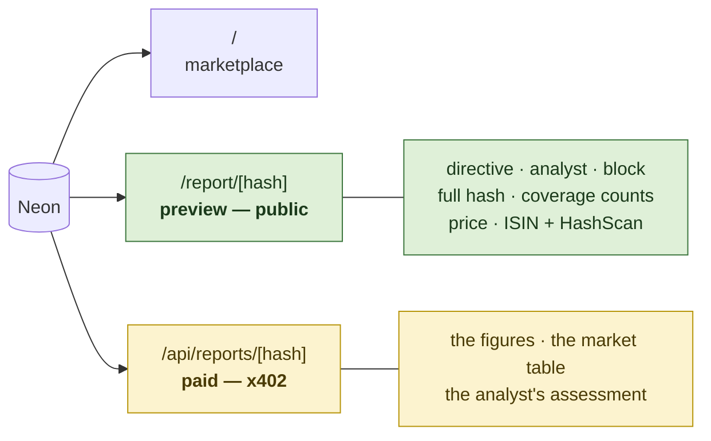

# app — where the paywall line falls

A Next.js App Router frontend and the HTTP surface a paying agent talks to. Deployed at
<https://et-honline-2026-alpha-markets.vercel.app>.

⚠️ **The whole design of this directory is one line: what a stranger sees free, and what a payment
buys.** x402's premise is paying for access to something you otherwise cannot see, so a paid route
serving content the public page already gave away would gate nothing and a settled payment would
prove nothing.

**The preview page deliberately never calls `render()`.** The split needed no change to the report
type and no preview mode on the renderer — it is field-level and already existed. The withheld
fields are *not sent*, not hidden: this was proved by grepping the served HTML for a figure from the
paid body and finding nothing, because a CSS-hidden table is not a paywall.

## Which routes are product and which are scaffolding

⚠️ **Seven of the eleven routes here are scaffolding**, and a reviewer should not have to open
files to find out which.

**Product** — `/` (marketplace), `/report/[hash]` (preview), `/api/reports/[hash]` (the paid read),
`/api/health` (does the facilitator still advertise our network and fee payer, and is the
third-party ATS resolver still alive).

**Throwaway, deleted before submission** — `/api/probe` was the deployment probe that measured
whether the dependencies fit a serverless function; it has answered and is still deployed.
`/console` and `/api/console/*` are an internal test surface with a button for every operation the
build can perform. ⚠️ **The console spends real testnet funds and has no authentication.** It says so
on itself. It exists because testing otherwise meant a CLI and a block explorer.

## Two things worth knowing

- **`markdown.tsx` is the escaping boundary.** Market names and token symbols are indexer-supplied
  and travel inside reports; they cannot be escaped on write, because the stored bytes are the
  hashed bytes. So escaping happens here, at the last possible moment, by producing React elements
  rather than an HTML string — there is no `dangerouslySetInnerHTML` anywhere and therefore nothing
  to sanitise. It is not a general markdown parser and should not become one.
- **Pages read the store directly; routes exist only where an HTTP contract is genuinely needed.** A
  paying agent needs one. A browser rendering server-side HTML does not, and adding a route for it
  would be a second copy of a query behind a fetch the server makes to itself.

⚠️ **No product route generates a report.** Generation is a CLI job — see `src/payments/README.md`
for why putting it inside a paid request would be unsafe — and a visitor cannot commission one. The
throwaway console *can* generate, through `/api/console/generate`, which is one of the reasons it is
not product and is deleted before submission.
