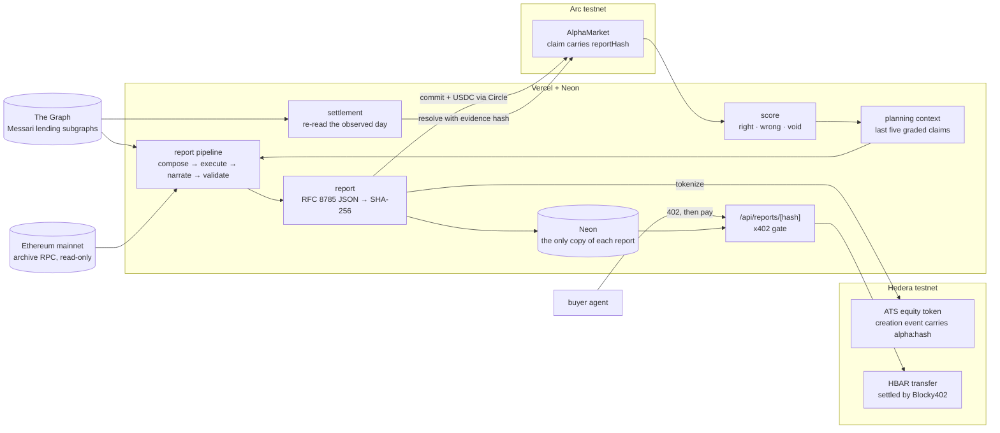
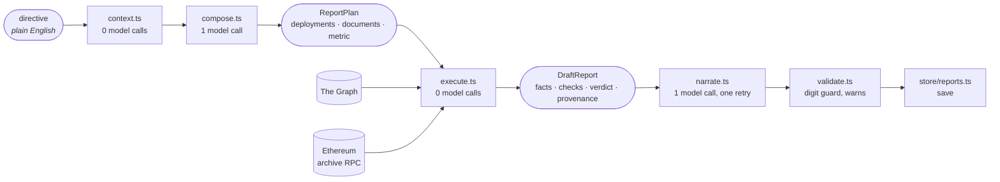
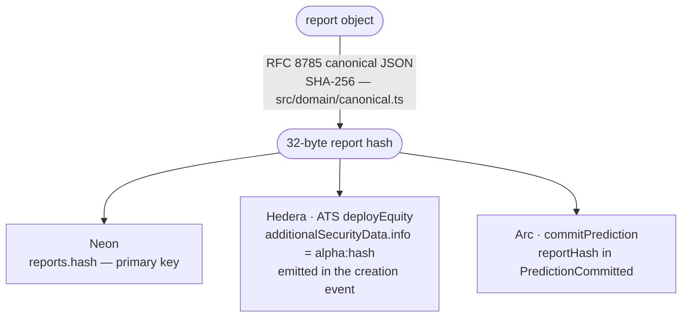
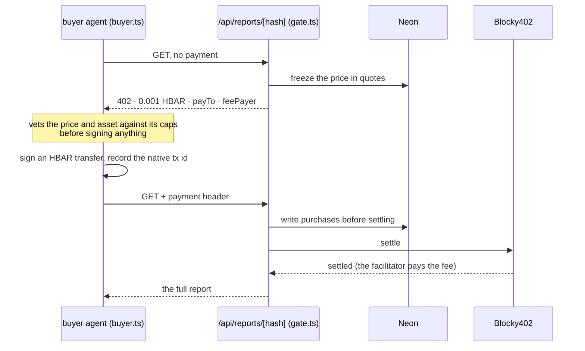
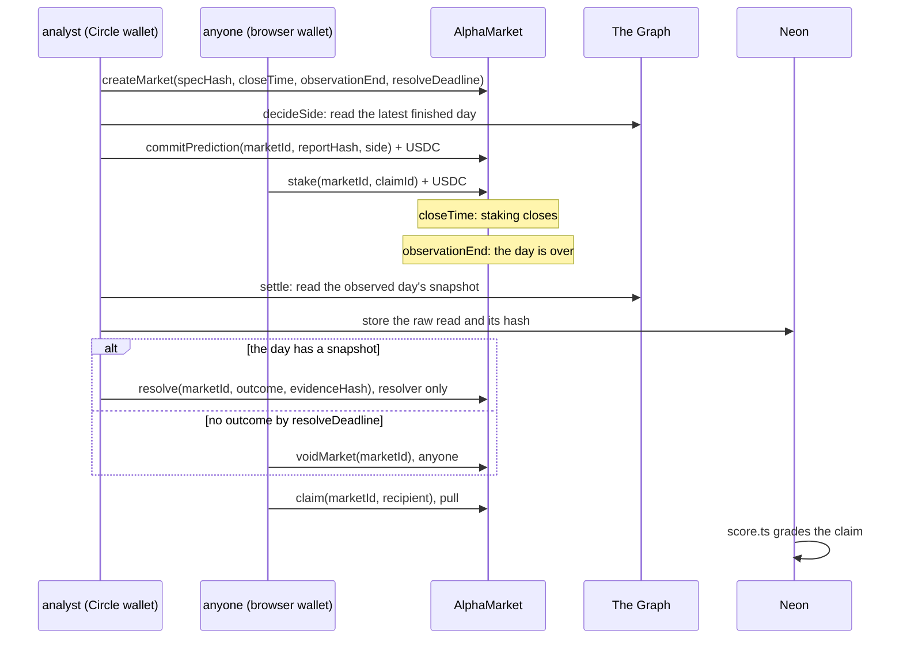
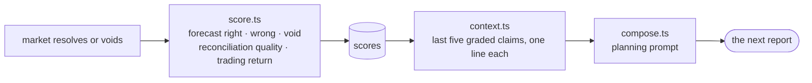

# Architecture

The system as built, on one page. As of 2026-09-13, everything described here runs against live
networks: The Graph's gateway, Ethereum mainnet (read-only), Hedera testnet, Arc testnet, Neon and
Vercel.

**Contents:** [1 · The whole system](#1--the-whole-system) ·
[2 · Directive to report](#2--directive-to-report) ·
[3 · One hash, two chains](#3--one-hash-two-chains) · [4 · Hedera](#4--hedera) ·
[5 · Arc](#5--arc) · [6 · The feedback loop](#6--the-feedback-loop) ·
[7 · Where everything lives](#7--where-everything-lives) · [8 · Who signs what](#8--who-signs-what) ·
[9 · What is not built](#9--what-is-not-built)

---

## 1 · The whole system

**There is no arrow between Hedera and Arc, and that is deliberate.** Nothing calls across chains
and nothing bridges. Both chains carry the same 32-byte report hash, and a reader checks each one
independently (§3).

---

## 2 · Directive to report

| stage | in → out | what it decides |
|---|---|---|
| **context** | analyst → a few lines of text | the analyst's last five graded claims, for the planner |
| **compose** | directive → `ReportPlan` | which deployments, which documents from a fixed menu, and which metric. It never writes GraphQL and reads no data. |
| **execute** | plan → `DraftReport` | one block every deployment can answer at, or a refusal; then fetch, paginate, check, corroborate against Ethereum, and assemble |
| **narrate** | draft → `Report` | one table and one paragraph in `{fact:ID}` placeholders. Code fills the values, so the model cannot type a figure. |
| **validate** | report → warnings | flags any digit written outside a placeholder |
| **save** | report → row | the canonical JSON as TEXT, keyed by its hash. `load()` re-derives the hash on every read. |

**Where it runs:** `scripts/ops/report.ts` on the command line, and `POST /api/console/generate`
streamed to `/console`. The code is in `src/agent/`, `src/graph/`, `src/engine/`, `src/domain/` and
`src/store/`.

**Why the data can be compared at all:** every deployment publishes Messari's standardized lending
schema. The three query documents run unchanged across the five schema versions live today. Quirks
where a deployment uses standard names for different meanings are measured into
`src/config/protocols.ts` and flagged by `src/graph/adapter.ts`, never corrected.

---

## 3 · One hash, two chains

**Check it yourself, with no help from us.** One report, verified on 2026-09-13:

| | where | what to look for |
|---|---|---|
| the report | [`/report/f2285b4e…`](https://et-honline-2026-alpha-markets.vercel.app/report/f2285b4e60905abf34fc2d503913421b13212951e6cf203d0d769d204ce3a84e) | the hash `f2285b4e60905abf34fc2d503913421b13212951e6cf203d0d769d204ce3a84e` |
| Hedera | token deploy tx [`0x9cf06d00…` on Mirror Node](https://testnet.mirrornode.hedera.com/api/v1/contracts/results/0x9cf06d007f474fdf43687deb3f226460292c0b80c483269ea8f91b5f9094edac) | the logs contain the hex of `alpha:f2285b4e…` |
| Arc | commit tx [`0x0eb87e36…` on arcscan](https://testnet.arcscan.app/tx/0x0eb87e3672a1c7205186d66479fe840f83cf450c2c5bcb74852ee044bcc46ec8) | the `PredictionCommitted` log's `reportHash` is `f2285b4e…` |

The token also carries an ISIN derived from the same hash (`src/tokenize/isin.ts`). The ATS factory
validates the ISIN's check digit on chain.

Before our code commits a report on Arc, `src/arc/admission.ts` confirms three things on Mirror Node:
the report was tokenized, by this analyst's Hedera account, with this hash in the creation event. The
contract itself cannot know. To it, `reportHash` is 32 bytes.

---

## 4 · Hedera

**Tokenization** (`src/tokenize/`). Each tokenized report becomes its own ATS equity security. The
build uses ATS's public testnet factory (`0.0.9213391`) and resolver (`0.0.9212226`) through
`@hashgraph/asset-tokenization-contracts`:

`deployEquity` (supply 1, decimals 0, hash-derived ISIN, Reg S, `alpha:<hash>`) → `grantRole(ISSUER)`
→ `issue(analyst, 1)`, then `transfer` as the lifecycle operation.

Two-phase throughout: `prepare()` checks everything and spends nothing, and only then does anything
spend. Nothing retries.

**Payments** (`src/payments/`). An x402 exchange on Hedera testnet, settled through Blocky402:

`payTo` is read from the report's analyst row. The public preview page never renders the paid body.

---

## 5 · Arc

**The contract** (`contracts/AlphaMarket.sol`, deployed at
[`0x003e7Cb7…8044`](https://testnet.arcscan.app/address/0x003e7Cb791257B529bb5f9F6D17A846264d48044)) is
a parimutuel binary market. A market asks one question with no free text: is one deployment's metric
above a threshold on one UTC day (`src/arc/spec.ts`).

- **The evidence is stored before the chain call.** `settle.ts` writes the raw read, and
  `resolve.ts` takes the hash off that stored row and never recomputes it. The on-chain hash always
  commits to bytes that exist.
- **The resolver is immutable** and is the analyst's Circle wallet. A different analyst needs a
  different deployment. Voiding is permissionless after the deadline and claims are pull-based, so a
  missing resolver cannot strand funds.
- **What drives it:** two daily crons (`/api/cron/commit` at 22:00 UTC, `/api/cron/resolve` at
  02:00 UTC), the market page's commit and stake controls, the demo buttons on `/markets`, and the
  `scripts/ops/` tools. ⚠️ So far, every Arc transaction was started by a command or a press. No
  cron-sent transaction has been evidenced.
- **Rehearsals and past-posted markets never count.** A market created after its day ended, or
  whose staking closed inside or after it, is excluded from the record by arithmetic
  (`src/arc/rehearsal.ts`). Demo markets are past-posted on purpose, so the loop can be played in
  minutes.

---

## 6 · The feedback loop

**This is text in a prompt, not training.** A digest of the block the planner saw is stored as
`reports.context_digest`, outside the hash. `/analyst` shows the block verbatim.

⚠️ **Only one of the three scores carries signal today.** Reconciliation quality is null on every
stored report. Trading return is null because nothing records the contract's `Claimed` events. That
is why neither of those two reaches the prompt.

---

## 7 · Where everything lives

| place | what lives there |
|---|---|
| **Neon** | Report bytes, tokens and transfers, quotes and purchases, markets, claims, stakes, settlement and binding evidence, scores (`src/store/`) |
| **Hedera testnet** | One ATS token per tokenized report, with the hash in its creation event. x402 payments as HBAR transfers from buyer to analyst. |
| **Arc testnet** | AlphaMarket: markets (spec hash), claims (report hash, side, author), stakes and payouts in native USDC, and the evidence hash of each resolution |
| **Vercel** | The Next.js app, its API routes, and the two crons (`vercel.json`) |
| **The Graph** | Read-only. The source of every figure, both when a report is written and when a market settles. |
| **Ethereum mainnet** | Read-only. Block timestamps, and corroboration of subgraph figures at the block they were written. |
| **This repo** | `src/arc/attestation.ts`: the analyst's two keys signing one sentence, recoverable offline |

---

## 8 · Who signs what

| identity | key held by | signs | cannot |
|---|---|---|---|
| **Analyst on Arc** `0x1B7035bB…16A7` | Circle, as a developer-controlled wallet | `createMarket`, `commitPrediction`, `resolve`, `voidMarket` | be replaced on the existing contract, because the resolver is immutable |
| **Analyst on Hedera** `0.0.10387690` | `HEDERA_SELLER_KEY` | ATS deploy, grant and issue; receives x402 payments | act on Arc |
| **Buyer agent** `0.0.10387696` | `HEDERA_BUYER_KEY` | x402 payments, within its caps | spend above its per-payment cap |
| **Deployer** `0xA6B12d84…8079` | `ARC_DEPLOYER_KEY` | the contract deployment | resolve |
| **A visitor** | their own browser wallet | `stake`; on a demo market, their own `commitPrediction`; `claim` | resolve |

`src/arc/identity.ts` joins the two analyst keys with a signed attestation, so the link between them
does not rest on `config/analysts.ts` alone.

---

## 9 · What is not built

Listed in full, with file paths, in the root [README](../README.md#what-is-not-built). In short:
- no user identity;
- one analyst, not many;
- trading return and reconciliation quality are null;
- no cron-sent transaction evidenced;
- no spend cap;
- the console lock is unwired;
- 7 of 11 report tokens are not yet verified on Sourcify;
- humans cannot pay over x402 in a browser;
- the contract has no test suite and is not source-verified on arcscan;
- nothing is on mainnet.

Mainnet readiness is documented in [`arc-deployment.md`](arc-deployment.md).
