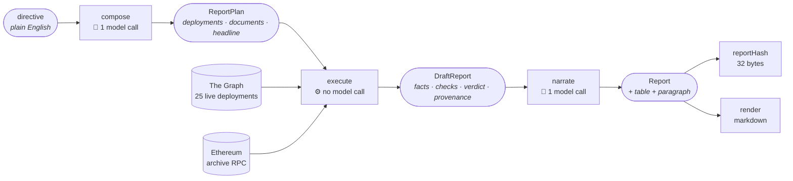
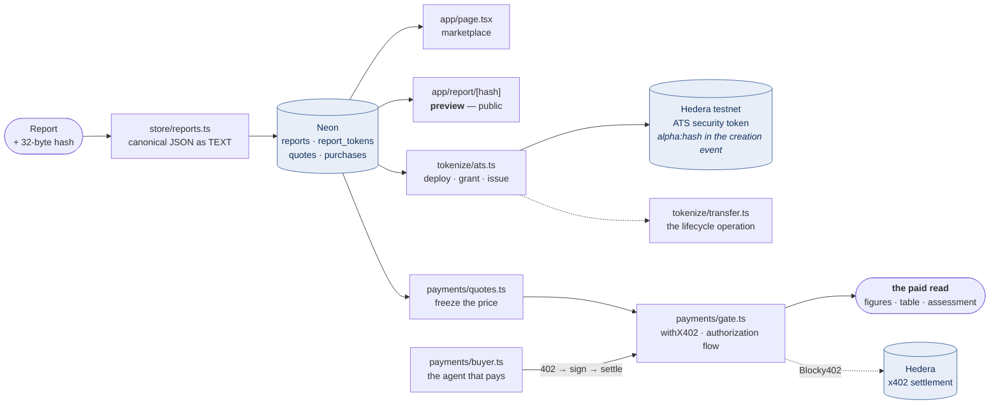

# Architecture

One page, end to end. Read this before opening a directory.

A plain-English directive goes in. A hashed, verifiable report comes out, is stored, becomes a
security token on Hedera, and sells behind a paywall. Between the directive and the report are **two
model calls and nothing else that is not deterministic.**

## 1 · Directive → report

| stage | in → out | model calls | what it decides |
|---|---|---|---|
| **compose** | directive → `ReportPlan` | 1 | which deployments, which documents, which metric the report is about. Reads no data |
| **execute** | plan → `DraftReport` | 0 | one block the whole set can share, then fetch, check, assemble. Can refuse, block, or run out of budget |
| **narrate** | draft → `Report` | 1 | the table's shape and the paragraph. Cannot write a number |
| **render** | report → markdown | 0 | substitutes `{fact:ID}` placeholders with values. One view of the object, not the report |

`scripts/ops/report.ts` is the entry point that runs all four and persists the result.

## 2 · Report → product

**The preview is the product boundary.** `app/report/[hash]/page.tsx` deliberately never calls
`render()`: it shows the directive, analyst, block, full hash, coverage counts, price and tokenized
state. The figures, the market table and the assessment are only ever sent by
`app/api/reports/[hash]/route.ts`, after a payment settles. x402's premise is paying for something
you otherwise cannot see, so a paid route serving what the page already gave away would gate nothing.

## The three guarantees, and where each lives

**Numbers enter once.** Every figure comes through `graph/client.ts` and nothing caches, so a figure
in a report traces to a query that actually happened. `graph/adapter.ts` then annotates what cannot
be trusted and **never adjusts it** — a wrong number stays wrong with a finding attached, because an
adjusted figure is one nobody can trace.

**No model ever types a digit.** The narrator is handed a fact table and can only reference it as
`{fact:ID}`; code substitutes the values. That is why an invented figure is unrepresentable rather
than unlikely. `agent/validate.ts` checks the prose *before* substitution — a legitimate figure is
still a placeholder at that point, so any money or percentage left in the text is fabricated by
construction. ⚠️ **It runs on every report and warns rather than blocks**, deliberately: today's
dominant violation is a utilization column the model computed from figures this pipeline really did
fetch, and a guard that fails every report teaches everyone to route around it. ⚠️ **Enforcement was
scheduled for Phase 3 and did not happen; it is now Phase 4**, gated on two missing fact ids and the
rank-ordinal question — see `tracking/DECISIONS.md`, *"The digit guard warns in Phase 2 and enforces
in Phase 3"*, and the amendment in `tracking/phases/PHASE-3.md`.

**The report is an object; the hash is over the object.** Markdown, a file, HTML — all renderings,
all must hash identically. `domain/canonical.ts` produces the 32 bytes that get committed on Hedera
in the ATS creation event and passed to Arc, which is what lets two chains refer to the same report.

## What is built, and what is not

**Live and deployed** — <https://et-honline-2026-alpha-markets.vercel.app>

Phases 0, 1 and 2 are complete. Phase 3 is substantially complete: **8 reports** persist in Neon, the
app serves a marketplace and a per-report preview, **4 reports are ATS security tokens** on Hedera
testnet with the report hash in the creation event, **3 of those have been transferred**, and the
paid read is gated by x402 and settled through Blocky402 — **3 real payments** have settled end to
end. Counts checked against the deployment on 2026-09-09.

**Not built, and honestly named:**

| | |
|---|---|
| `payments/recover.ts` (Unit 17) | ambiguous-settlement recovery and the payment-identifier response cache. A Hedera settle failure and a settle *timeout after broadcast* are the same `{success: false, transaction: ""}`, so a timed-out buyer today has a native tx id and no reconciler |
| `payments/auth.ts` (Unit 18) | EIP-191 human identity. The declared cut point — dropping it costs product surface and no requirement |
| Play gaps 11 and 16 | deliberate break-it-on-purpose passes, folded into end-stage testing |
| **All of Phase 4** | the prediction market on Arc: a Solidity contract, an Arc client, market and settlement logic, and the scoring path. Unstarted |

**Known gaps inside what is built** — `quotes.state` is never written, so every quote row is `'open'`
forever; `Report.atsTokenAddress` is always `null` and `report_tokens` is the de facto source of
truth, which has never been decided either way; `tokenize/ats.ts` leaks two database clients;
`app/api/probe/` and `app/console/` are throwaway surfaces still deployed.

## Where to go next

⚠️ **This page used to promise "each subsystem then has its own README", and six directories have
none.** Four subsystems have one — they are the Phase 2 subsystems, deep enough that the reading
*order* matters as much as the files. The Phase 3 subsystems are smaller and carry their reasoning in
unusually thorough file headers instead. **Writing six more READMEs four days from a deadline, for
code Unit 17 and Phase 4 will change, would manufacture exactly the staleness this document is being
corrected for** — so the promise is dropped and the table below names files where there is no README.

| you want | read |
|---|---|
| the report shape another analyst must target | `src/types/README.md` → `report.ts` |
| how data is fetched and trusted | `src/graph/README.md` |
| how a verdict is decided | `src/engine/README.md` |
| the pipeline, and why `agent/` holds two systems | `src/agent/README.md` |
| how a report is stored, and the two Neon URLs | `src/store/db.ts` header, then `reports.ts` |
| how a report becomes a token on Hedera | `src/tokenize/ats.ts` header, then `hedera.ts` |
| how the paywall works | `src/payments/gate.ts` header, then `server.ts` and `quotes.ts` |
| what the app serves, and where the paywall line falls | `app/report/[hash]/page.tsx` header |
| what to run | `scripts/README.md` |
| what is done and what is left in Phase 3 | `tracking/phases/PHASE-3.md` |
| why a decision was made | `tracking/DECISIONS.md`, `tracking/lessons.md` |
