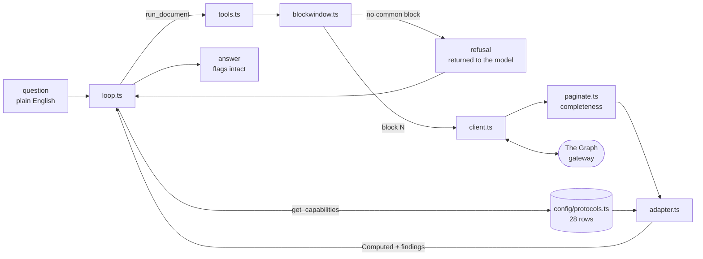
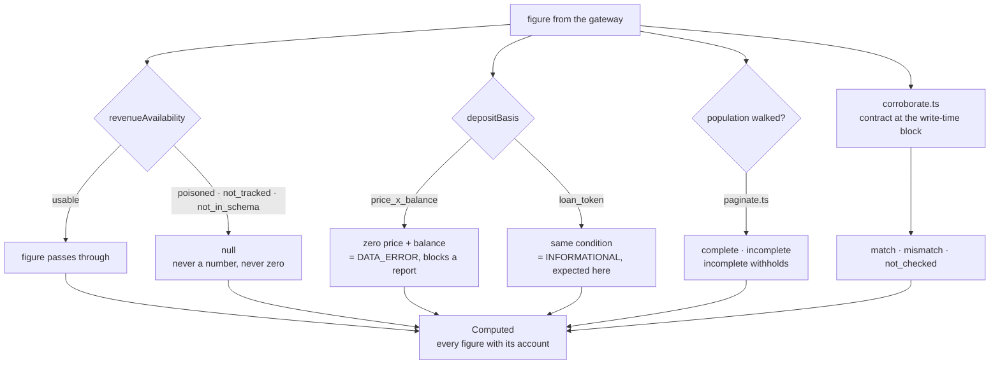

# Phase 1 — the data layer

*What we built, and what it found.*

Phase 1's job was to let the agent see. Not to write reports — to get numbers out of The Graph and
attach an honest account of how far each one can be trusted, so that nothing downstream can publish a
figure we cannot stand behind.

The phase has two halves. **Connect** is plumbing: config, a client, query documents, pagination,
block alignment. **Bound** is everything that stops a plausible-looking number reaching a reader:
corroboration against the chain, a plausibility layer, and flags that say *unavailable* rather than
guessing.

The second half exists because of what Phase 0 found. Morpho Blue uses Messari's exact field names
and means different things by them. Its headline TVL is inflated about 3.6×, its revenue was never
written, and it disagrees with its own contract. **Had it lied less cleanly we would have built a
field-renaming layer and shipped $13B as fact.**

---

## The thirteen units

| # | File | What it does |
|---|---|---|
| 1 | `types/wire.ts` | The shared vocabulary. Two shapes: `Computed` carries how we know a figure, `Report` is what gets hashed |
| 2 | `config/protocols.ts` | 28 deployments, one row each. Adding a protocol is adding a row |
| 3 | `graph/client.ts` | `querySubgraph` and a fan-out sibling. Always requests `_meta`, one retry on timeout, classified failures |
| 4 | `graph/queries/` | Three pre-written documents plus a registry. The agent picks from a menu; it never writes GraphQL |
| 5 | `scripts/sweep-protocols.ts` | Asks all 28 who answers, and writes the result back into config |
| 6 | `scripts/triage-protocols.ts` | Asks who is *right* — external reconciliation, internal plausibility, history, revenue sanity |
| 7 | `graph/paginate.ts` | Walks a population and says honestly whether it reached the end |
| 8 | `graph/blockwindow.ts` | One block every deployment can answer at, or a refusal |
| 9 | `graph/corroborate.ts` | Reads the contract at the block the subgraph *wrote* the value. Exact equality, no tolerance |
| 10 | `graph/adapter.ts` | The plausibility layer. Annotates; never adjusts |
| 11 | `graph/evidence.ts` | A record of what we looked at, so a figure stays traceable after the source prunes |
| 12 | `agent/loop.ts` | The tool-use loop. Owns neither the conversation nor the tools |
| 13 | `agent/tools.ts` | Exactly two tools: `run_document` and `get_capabilities` |

Units 14–17 — a protocol vetting script, Subgraph MCP, a Morpho Blue deploy, and the revenue fix —
are optional and unbuilt.

Each unit's proof runs against the live gateway. There are no mocks and no fixtures anywhere in the
data path.

---

## What we measured

**28 deployments configured, 25 answering.** Every Ethereum lending deployment in Messari's
`deployment.json` that is both `status: prod` and has a published query-id, plus morpho-blue, which
Morpho publish themselves on Messari's standardized template. Three do not answer:
`abracadabra-ethereum` and `morpho-compound-ethereum` have no indexer available,
`inverse-finance-ethereum` has one returning `indexing_error`.

**One document, five live schema versions, zero nulls.** The balance sheet runs unchanged against
3.1.0 (9 deployments), 2.0.1 (9), 3.0.1 (3), 1.3.0 (3) and 3.0.0 (1). Every field came back populated
on all 25 that answered.

**The field intersection is much wider than expected.** Measured by schema introspection against one
deployment per live version:

| entity | fields shared by all five versions |
|---|---|
| `LendingProtocol` | 25 |
| `Market` | 31 |
| `FinancialsDailySnapshot` | 21 |
| `InterestRate` | 4 |

Every revenue field is in that intersection, which is why the snapshots document is one document
rather than two. **Nothing in the query layer dispatches on schema version**, because measurement
found no case that needs it.

**Market populations vary by two orders of magnitude:** morpho-blue 1,759, rari-fuse 823, compound-v3
73, aave-v3 67, makerdao 63, aave-v2 37, compound-v2 20, spark-lend 20.

**Triage: 3 publishable, 11 flagged, 11 unusable**, of the 25 that answer. Revenue is deferred and
gated, so a deployment flagged only on revenue can still carry a balance report — on that basis
**5 are usable today**: aave-v3, aave-v2, compound-v2, compound-v3 and spark-lend.

Run blind across 25 deployments, triage converged on the same four Messari deployments Phase 0 had
picked by hand, and added spark-lend.

---

## What changed the design

**The poisoned revenue accumulator is a template fault, not a deployment fault.** aave-v3's
cumulative revenue reads $2.79e17 — a mapping fault booked $1.63e15 on one day in July 2024 and the
cumulative never recovered, recurring 38 times since. `spark-lend` reads $1.20e17: an Aave v3 fork on
the same Messari template, inheriting the identical fault. Expect more.

**Morpho uses the standard field names for different quantities.** `inputToken` is the collateral
token; `inputTokenBalance` is the loan. Collateral is absent from TVL. 48 of its 1,759 markets report
deposits exactly equal to borrows. Revenue is zero across 977 snapshots — absent, not small.

**Morpho disagrees with its own contract by exactly −10,000,000**, on the USDC/PAXG market. Found
first in SM-04 through a throwaway script, then reproduced through an entirely separate path —
different client, different block resolution, different contract call — to the same digit. Cause not
established. A second market disagrees by ~0.02%. Nothing was tuned to make them agree.

**`_meta.block.number` is one indexer's head, not the deployment's.** Every sweep reported zero block
spread across deployments, which is true of whichever indexer answered. Asking for a block above the
head makes the gateway list all of them:

| deployment | indexers | head spread |
|---|---|---|
| aave-v2-ethereum | 10 | **57,859 blocks** |
| compound-v3-ethereum | 7 | 5,568 |
| compound-v2-ethereum | 7 | 5,565 |
| aave-v3-ethereum | 4 | 5 |
| spark-lend-ethereum | 2 | 6 |

The deployments agree; the fleets serving them do not. This also surfaced a real bug: the failure
classifier read only the first indexer's status and decided the verdict for all of them, reporting a
permanent condition as "wait and retry."

**Config and live schema versions agree everywhere.** We checked whether deployments drift from what
Messari's `deployment.json` declares, and across all 25 that answer, **none do**. The adapter still
dispatches on the live value rather than the config value — the check costs nothing and the day it
matters, it matters — but the drift we were guarding against is not currently happening.

**Eight deployments report a live balance sheet and no recent history.** `euler-finance` reports
$188M in deposits and zero daily snapshots for the last seven days; `truefi`, `qidao`, `aave-arc`,
`aave-rwa`, `morpho-aave-v3`, `cream-finance` and `zerolend` are the same shape. A deployment that can
answer a balance sheet but has no history cannot back a period question or a settlement.

**compound-v3 has a live `DATA_ERROR` that triage missed.** One market prices zero with a non-zero
balance. Triage sampled protocol totals; the adapter is the first check to look at market-level
oracle state. §5.13 says a `DATA_ERROR` blocks a report, so compound-v3 — verdict `publishable` —
would not publish right now.

**The retained window is roughly 500 blocks, and aave-v3 is the outlier.** aave-v3 serves reads
439,844 blocks deep (61 days); aave-v2, compound-v2, compound-v3 and spark-lend all fall between 300
and 600. Measuring the flagship first suggested the window was three orders of magnitude larger than
the plan assumed, and generalising from it would have inverted a design decision. The floor is the
tightest deployment in the set, never the loosest.

**A field missing from a schema errors loudly; it does not return null.** GraphQL validates the
document before executing it, so a version mismatch is the *loudest* failure the gateway produces, not
the quietest. Nulls mean something else: a field that exists and was never written.

---

## How it fits together



The trust layer is what turns a returned number into one with an account attached. Every
per-deployment fact it keys off is measured and stored in config — **no rule anywhere tests a slug**,
because that would mean adding a 29th protocol required editing the adapter.



The clearest illustration is the oracle guard. `inputTokenPriceUSD == 0 && inputTokenBalance > 0` is
a blocking `DATA_ERROR` on compound-v3, where deposits derive from price × balance and a zero price
silently empties a real market. The same condition holds on **1,029 of morpho-blue's markets** and is
entirely expected there, because Morpho takes the price from the collateral and the deposit value
from the loan token. Same condition, same field names, opposite meanings. A global guard would be
unusable; a slug check would break the one-config-row claim. A measured fact in config gives the
right answer for both.

---

## What the agent does now

Asked *"which protocol has the most deposits?"*, the agent requested all 25 live deployments in one
call and got back:

```
refused: no common block across these deployments
reason:  heads are 1598 blocks apart and the tightest deployment retains only 300
```

`goldfinch-ethereum` and `rari-fuse-ethereum` were 4.2 hours behind, sharing one stale indexer. The
agent dropped them, re-ran the other 23 at a common block, ranked the results — and said this:

> Two deployments are missing from this comparison… I excluded them rather than read them at a
> different moment… treat them as unread, not as zero.

Nobody designed that path. The refusal reached the model as a result rather than an error, and it
treated a gap in the data as information about the data. In the same answer it placed morpho-blue
second at $13.09B and immediately undercut it — unusable verdict, inflated roughly 3.6×, disagrees
with its own contract — then declined to substitute a corrected figure.

Asked about revenue across aave-v3, spark-lend and compound-v2, it reported the one usable number,
noted that even that one is *uncorroborated* because compound-v2 records no write-time field, and
refused to estimate the other two: *"inventing a proxy would be worse than the gap."*

---

## What is deferred, and what is incomplete

**Revenue is deferred out of Phase 1.** Three deployments have clean revenue; aave-v3 and spark-lend
share a poisoned accumulator that cannot be corrected by subtraction, because it is a recurring fault
rather than one bad event. Two routes remain — deploy a corrected Messari subgraph, or derive revenue
in the engine from cumulative borrow deltas — and the choice waits until we know how many of the 25
are affected. Balances, deposits, borrows and utilization are trustworthy and sufficient to build on.

**The gating is not uniform, and this is the honest limit of Phase 1.** Only revenue is genuinely
withheld — a poisoned figure becomes `null` and cannot be rendered. Morpho's inflated TVL is
*flagged and present*: the adapter attaches findings and it remains the model's judgment whether to
use the number. In practice the model has consistently declined to, but that is behaviour rather than
a guarantee. Turning a flag into a refusal is Phase 2's engine, where `DATA_ERROR` and an incomplete
population become the two conditions that block a report outright.

**`corroborate.ts` and `evidence.ts` are built and unreached from the agent path.** Both work and
both have proofs; neither is called by a tool. The chain check that caught Morpho is currently
demo-only, and evidence records have nowhere to be stored until Phase 3.

**Standards leverage has not been rehearsed.** Adding a protocol is demonstrably one config row — the
table holds 28 — but the act of adding one and watching it appear has never been performed.

**Smaller gaps:** Morpho's −10,000,000 has no established cause; compound-v3's contract accessor is
unmeasured, so its corroboration is `not_checked` rather than checked; 22 untested rows carry null
quirk columns; and nothing is deployed yet.

---

## Reproducing any of this

```bash
npx tsx --env-file=.env scripts/sweep-protocols.ts --inventory   # who answers, regenerates the inventory
npx tsx --env-file=.env scripts/triage-protocols.ts              # who is right
npx tsx --env-file=.env scripts/demo-corroborate.ts              # subgraph vs chain, per market
npx tsx --env-file=.env scripts/demo-adapter.ts                  # raw figures in, flagged figures out
npx tsx --env-file=.env scripts/ask.ts "your question"           # the agent, end to end
```

Every one of these hits the live gateway. `docs/protocol-inventory.md` is regenerated by the first
command and holds the current table for all 28 deployments.
