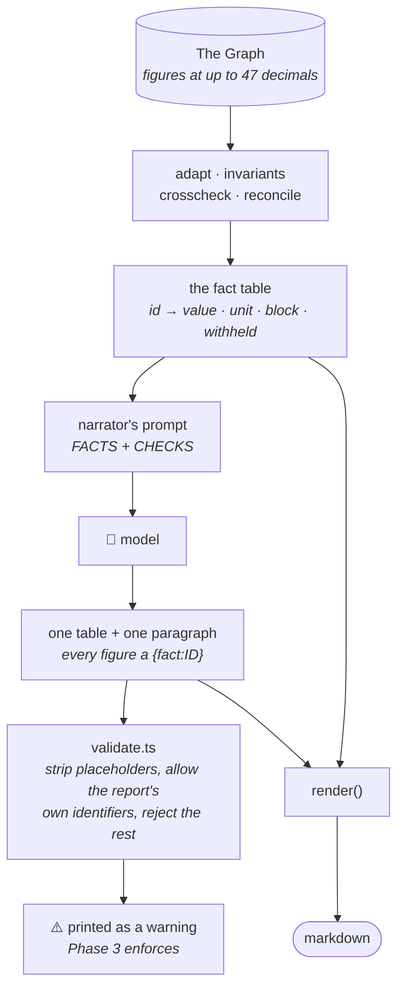
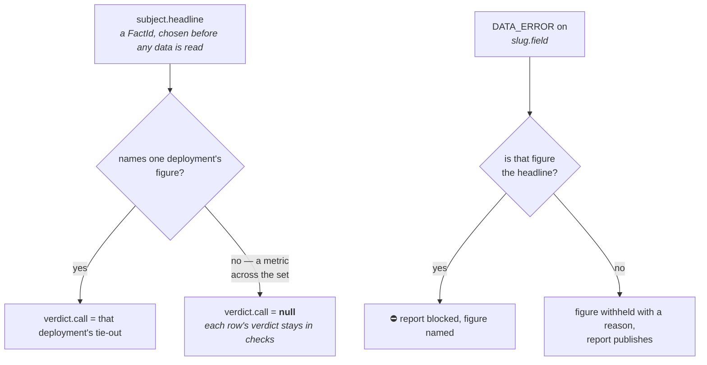

# Phase 2 — the reporting pipeline

*What we built, and what it found.*

Phase 1 gave the agent eyes. Phase 2 was meant to give it judgment: take a directive in plain
English, turn it into a structured financial report with figures that tie out, and attach a verdict
it can defend.

Before it, the output of `ask.ts` was whatever prose the model chose that run. Two questions about
the same protocol came back differently shaped, nothing checked internal consistency, and nothing
stopped the model writing a figure that was never in the data.

The phase has two halves that turned out to be about different problems. **The engine** — canonical
hashing, decimal arithmetic, invariants, reconciliation, crosscheck — is deterministic and was
largely built to plan. **The pipeline** — plan, execute, narrate, validate — was not, because most
of what we got wrong was about what to *show*, not what to compute. The engine still computes
everything it computed in the first week. The report prints a fraction of it, and that gap is the
most useful thing the phase produced.

See `docs/ARCHITECTURE.md` for the four stages end to end; this document is what happened while
building them.

---

## The eleven units

| # | File | What it does, and what it found |
|---|---|---|
| 1 | `types/report.ts` | The report as a **public contract** — a separate file from `wire.ts`, written for someone who has never seen this repo. Split `Verdict` (what the engine computed) from `Assessment` (what the analyst thinks), which resolved the open `Confidence` question the other way round: a judgment label belongs on the judgment |
| 2 | `domain/canonical.ts` | 32 bytes over the report object, reusing SM-01's implementation rather than rewriting it. **SM-01's hashes reproduce exactly two days later.** Changing one word of prose — "held" to "holds" — moves the hash, which is the point: narration is inside it |
| 3 | `engine/ops.ts` | Decimal arithmetic on BigInt, no dependency. `ratio('0','0')` is `null` and `ratio('0', x)` is `'0'`, because two deployments report zero deposits and zero borrows and "undefined" rendered as zero reads as an answer |
| 4 | `engine/invariants.ts` | Five checks, four severities, and a blocking rule that names a **figure** rather than a deployment. compound-v3's one bad market blocks its deposit figure and not its borrow report — one `DATA_ERROR`, two subjects, two outcomes |
| 5 | `engine/reconcile.ts` | The tie-out, in three tiers. Internal consistency can never produce `ties_out`, because SM-03 measured aave-v3's revenue sides summing exactly on all 31 days while the total was wrong by ten orders of magnitude. Only a source outside the mapping code can certify a number |
| 6 | `engine/crosscheck.ts` | 50 lines, half the planned size, and deliberately a translator rather than a second checker. A chain mismatch is a `SIGNAL`, **not** a `DATA_ERROR` — blocking would mean asserting the contract is the correct side, and this check cannot tell |
| 7 | `agent/skills/` | Markdown loaded into the prompts. Proved by running one directive with and without them; the with-skills run volunteered a distinction our own code does not draw — that the corroboration statuses came from a config sweep, not from a check it ran. It also found morpho-blue's `cumulativeDepositUSD` reading **$3.78 × 10²³** |
| 8 | `agent/compose.ts` | A directive becomes a plan, in one model turn, before any data is read. Built **after** Unit 9 was blocked on it — the brief order skipped it, and Unit 9 consumes the plan shape Unit 8 exists to decide |
| 9 | `agent/execute.ts` | The spine. Resolve one block the set can share, fetch pinned, run the engine, assemble the object, hash. **No model call.** Returns a `DraftReport` and a `dataHash` that is explicitly *not* the identity a market settles against, because narration is inside the real one |
| 10 | `agent/narrate.ts` | The second model call. One table string and one paragraph, every figure a `{fact:ID}` placeholder the model cannot fill itself. `factRefs` are extracted from the text by regex rather than supplied by the model, so the two cannot drift apart |
| 11 | `agent/validate.ts` | The digit guard. Strip placeholders, allow tokens the report's own data supplied, reject every digit left. The allowlist is derived from the report rather than hardcoded, so a block number passes only if it is the block this report was read at |

A **ranking form** was added mid-phase — `skills/ranking.md` plus changes to compose, execute,
narrate and `types/report.ts` — and then removed with the rest of the forms four hours later. It is
parked in `skills/unused/`. Its real contribution was three bugs that only appear at 25 deployments,
below.

Every unit's proof runs against the live gateway and the live model. There are no mocks in the data
path.

---

## What we found that changed the design

**The report format was stripped twice, and the second strip cut something we had celebrated that
morning.** Every caveat rule we added was individually right — flag what you cannot stand behind,
explain a withholding rather than dropping it silently, say what was checked and what was not, say
that `consistent_only` is normal, say that an absence is not a finding. Together they produced a
compliance document. The Aave memo spent more words on what could not be verified than on what the
protocol is: a *Checks* section explaining that no external reference was supplied, an *Exclusions*
section explaining that nothing was excluded, and a verdict restated in three places.

The mechanism is worth naming. Each rule told the model to *account for* something. Given six such
rules and no counterweight, accounting for things became the task and the analysis became whatever
fit in the space left. **We had taught it to perform carefulness rather than to think.** The first
strip took the skills from 288 lines to 131 and cut the verdict line, provenance block, checks
summary and footer. The second cut two paragraphs to one — and with it the *Reading of the directive*
paragraph that had been the best output of the previous session, on the grounds that a sentence about
the query is a sentence not about the market.

⚠️ **Everything the engine computes still lands in the `Report` object and inside the hash.** Checks,
verdict, coverage, provenance and exclusions are all still there and unrendered. This was a rendering
decision, not a retreat from correctness, and `render()` carries a comment saying so.

**Report forms were removed entirely — the table follows the query now.** There were two,
`balance-overview` and `ranking`, each with its own skill file and its own fixed section list.
`Report.form` is now always `null`, kept in the shape rather than deleted because re-adding a hashed
field is more expensive than leaving one null. What the form encoded is still true and lives in
`subject.headline` instead: a headline naming one deployment's figure means an error there blocks the
report; a headline naming a metric across a set means an error on one demotes that deployment and the
report stands. `execute` reads that off the headline rather than off a form.

The strongest constraint in the format now is not a sentence in a skill — it is that the narrator's
tool accepts one table and one summary. There is nowhere to put performed carefulness, so spending
words on a caveat costs the analysis directly.

**`needs_clarification` was removed, because it worked.** It was structural rather than a prompt
instruction — two tools, `propose_plan` and `need_clarification`, with `tool_choice: 'any'`, so the
planner had to call one. StreamingFast's own eval says skill text alone does not override model
posture, and forcing a typed choice does. Then *"what protocol has the best financial health?"*
earned a well-reasoned refusal, and a refusal is the wrong answer. Health is not a quantity anyone
holds and the proxies for it disagree — all true, and an analyst asked that question still picks a
reading, says which, and answers. The defaults moved into `conventions.md` (deposits means current,
size means gross, "top N" with no N means ten), loaded by **both** compose and narrate so a memo
cannot declare a reading its own plan never took. The surviving `ok: false` arm is now for one thing
only: a plan naming a deployment that is not configured or not answering.

**The planner could not name a document, so every report was protocol-level by construction.**
`compose` had never once planned the `markets` document, including when a directive asked for markets
outright. It was not a missing rule. The planner was shown the whole catalogue as
`Available documents: balance-sheet, markets, financial-snapshots` — three bare strings with no
indication that one of them returns a row per market — plus a warning added two days earlier telling
it the markets walk "costs a great deal". The sum of what it knew was a name and a discouragement.
The catalogue now lives beside the registry as `DOCUMENT_BRIEF` in `graph/queries/index.ts`, one line
per document on what it returns and at what granularity, and the cost stays as a fact it can weigh
rather than an instruction. `reads` became required on the plan, because omitting it fell through to
a balance-sheet default and nothing recorded that no choice had been made.

**The verdict on a multi-deployment report was whichever deployment came first, and it was inside
the hash.** `Verdict.call` was filled from `slugs[0]`, because the headline-matching branch could
never match a metric sentinel. That is arbitrary, and worse: the same data planned in a different
order produced a different report identity. `Verdict.call` is now `VerdictCall | null`, and null is
the answer for a metric across a set — the worst across the set stamps `discrepancy` on a table where
twenty-two of twenty-three rows tie out, the best hides the row that fails, and an aggregate rule
answers a question nobody asked, since a reader of a ranking wants row 2's verdict and that lives in
`checks`. Iteration is now sorted for the same reason. ⚠️ **This is a change to the published `v1`
schema**: an existing consumer reading `call` as a string breaks on null. One ordering dependency
remains — `subject.deployments` is passed through in the planner's order and is hashed.

**Unit 11's first act was to prove that reports we had been reading all week contain figures nobody
can trace.** The validator was written, tested against five cases, and pointed at two real reports.
Both failed, which was predicted — but two of the three failure *kinds* were the tokeniser rather
than the model: `v2's` was rejected while `v2` was allowed, and five MakerDAO collateral types were
rejected by name because the allowlist's separator split ate the hyphen inside `RWA015-A`. A guard
that fires on English grammar or on a market's own name teaches everyone to ignore it.

What survived both fixes is the real finding. A protocol-level report fails on three computed
utilization percentages, and a market breakdown fails on `63`, twice. **The percentages are a correct
rejection** — there is no utilization fact, so the model computed them. **The `63` is true and
uncitable** — the market population, which the engine knows and reports in a check rationale but has
no fact id for. Both are the same shape: the engine failing to expose something the model needs, so
the model supplies it itself. A model given a true quantity it cannot cite will type it, because the
alternative is saying something false.

**Three bugs were invisible at five deployments.** Ranking across all 25 hit a token price with 47
decimal places and `ops.ts` threw — the working scale of 40 had been sized against the 23 places seen
on the development set, and the five were not representative (now 80, with the reasoning that the
constraint is significant digits *plus* leading zeros). The query budget of 40 did not cover 25
balance sheets plus corroboration (now 100). And the narrator's tool schema was fighting the model
silently: `sections` as an array whose `id` had exactly one legal value carried no information and
offered only repetition, so a directive about Aave's markets by category returned **29 sections and
no assessment**. A scalar makes that unrepresentable rather than discouraged.

**The narrator's prompt is mostly digits, and we left it that way.** Measured by rebuilding the
strings `context()` sends: a single-deployment plan shows the model 22 digit runs; a MakerDAO markets
plan shows it **1,644**, of which 190 are inside actual values. The suspected culprit — check
rationales — is flat at 5 either way. Blinding the model would make the prose shallower, because it
cannot say a book is concentrated without knowing whether the numbers are large or small. **The
guarantee moved to the boundary instead**, which is what Unit 11 is for.

**An external explanation that had been true once cost two days.** A report came back with a garbled
paragraph and the working explanation was the Anthropic spend limit — not a guess from nowhere, since
that had been exactly right days earlier when two proof runs failed on credit. Measured instead: five
narrations of one fixed draft, zero usable reports, three of them producing an identical
2,642-character table and then failing inside the summary. A billing failure cannot produce a
complete table and a well-formed tool call. **The test to apply is whether an explanation predicts
the *shape* of the failure, not just its existence** — and a previously-correct external explanation
is the most dangerous kind, because it already paid off once.

**Three of six file headers described designs that had been removed.** `client.ts` told a reader to
derive a block number a way the code no longer does — and Phase 4 settlement reads that exact field.
`compose.ts` described two tools when the clarification tool was gone. `narrate.ts` said "no
validation here" above a file that validates. Each change had been made under a tight scope, proven
with a run, and the correction written at the site of the change, which is where a careful person
puts it — and that is what left two contradictory comments in one file. The header is now part of the
diff.

---

## How the guarantee actually holds

`docs/ARCHITECTURE.md` has the four stages. What it does not draw is the path a number takes, which
is the mechanism this phase exists to build.



The model sees every value and can reason about magnitude. It cannot write one, because the text it
returns is checked **before** substitution — a legitimate figure appears there as
`{fact:aave-v3-ethereum.totalDepositBalanceUSD}` and never as `$24.82B`, so any money or percentage
left in that string is fabricated by construction.

The other thing worth drawing is how much rests on the planner's declared headline. It is
load-bearing twice, and both were things the phase discovered rather than designed:



---

## What the pipeline does now

The clearest single run is the one that first planned a market-level document, on 2026-09-07.

Directive: **"list makerdao's individual markets"**. `compose` returned
`reads: [{markets, [makerdao-ethereum]}, {balance-sheet, [makerdao-ethereum]}]` on the first attempt
after `DOCUMENT_BRIEF` landed — and the run was **declined**, because `subject.deployments` came back
empty and an empty scope expanded to all 25 live deployments. A question about MakerDAO was scoped to
the whole fleet, and one deployment too stale to share a block took the report down. The plan
contradicted itself: its reads named one deployment and its subject named twenty-five. Scope now
falls back to the slugs the reads name before it falls back to everything, and the same run went from
a 25-deployment walk to **2 queries and 778 ms**.

With that fixed, the run does this. `execute` resolves one block every named deployment can answer
at, fetches the balance sheet and walks the market population to exhaustion — 63 markets — and turns
each row into two facts, deposits and borrows, so the fact table holds 126 market facts plus the
protocol totals. The engine runs; the market walk pushes a `market-population` check carrying the
count and whether the walk finished. `narrate` gets the facts and the checks and decides how many
rows are worth showing. It showed twenty-three, and said so:

> Twenty-three of the 63 markets in the complete book are shown here, the significant few plus the
> two PSM ilks flagged for having deposits exactly equal to borrows, which is expected behaviour for
> a peg-stability module rather than an anomaly.

Nobody told it twenty-three. The same directive shape asked for "top 5 collateral type markets"
produced five rows and a whole-book line. That is the split we want: the structure is fixed by the
tool, the row count is the model's.

⚠️ **And it typed `63`, twice — once in the table and once in the prose.** Unit 11 rejects that
report. The population count solved the honesty problem and created a provenance one, and it is the
same shape as the utilization column and the "Twenty-three of the 63" line before it. Three
instances in one week, all of them the model reaching for a true number the fact table cannot supply.

Two other behaviours worth recording from the phase, both of which the pipeline still does:

- Asked to rank all live deployments, `execute` dropped rari-fuse and goldfinch — head 25923375
  against 25923758 elsewhere — and the report said they were excluded rather than read at a different
  moment, and that neither exclusion is a judgment about those protocols.
- Asked for a net column, the narrator wrote: *"the platform supplies gross deposits and gross
  borrows as separate facts and does not publish a differenced figure, and I do not type arithmetic
  of my own into a table."* The no-typed-digits rule extended itself to no-typed-arithmetic without
  being told.

---

## What is deferred, and what is incomplete

**Revenue is still deferred, unchanged from Phase 1.** Three deployments have clean figures —
aave-v2, compound-v2, compound-v3. aave-v3 and spark-lend share a poisoned accumulator that is a
recurring template fault rather than one bad event, so it cannot be corrected by subtraction, and
morpho-blue's revenue mapping was never written. `poisoned` and `not_tracked` come through as `null`
and are rendered as the word *unavailable*, never as zero. Fixing it means a corrected subgraph or
deriving revenue in the engine from borrow deltas, and neither is Phase 2 work.

**The validator warns rather than enforces, and that is deliberate.** The report renders in full and
the violations print underneath it; nothing is blocked and no violation changes what a reader sees.
Every report generated today fails, and the dominant failure is the model computing a utilization
column from two figures this pipeline actually fetched — arithmetic on Graph data, not invention. A
hard refusal would reject every report for something we do not currently consider broken, and **a
guard that fails everything teaches everyone to route around it.** In Phase 3 a report becomes
something someone pays for and stakes on, and at that point "traceable to a query at a specific
block" stops being a design preference and becomes the thing being sold.

**Enforcement is blocked on two missing fact ids, in that order.** The market population count needs
to be emitted as a `unit: 'count'` fact — `FactUnit` already includes it and `show()` renders it — so
that "23 of 63 markets shown" can cite rather than type. Utilization needs computing in the engine,
where `ops.ratio` is exact and `show()` already renders a ratio as a percentage; today the model
divides, which is both uncitable and correct to about two significant figures. Closing both narrows
the warning to real fabrications, which is the precondition for enforcing. A third case is open and
undecided: a ranking's `| Rank |` column produces one violation per row, and whether an ordinal
should be exempt, become a fact, or leave the table has not been answered.

**⚠️ `src/agent/` holds two systems that never call each other, and Phase 3 forces the decision.**
The report pipeline is `compose → execute → narrate`, deterministic code with a model call at each
end. The tool-use loop is `loop.ts` and `tools.ts`, used only by `scripts/ask.ts`. `execute` does not
use `tools.ts`; `compose` and `narrate` each open their own API call rather than going through
`loop.ts`. The only thing shared is the `MODEL` constant, which lives in `loop.ts` — so the two files
that import it are both in the half that does not use the loop. The directory name describes the
smaller half, and `execute.ts` is the largest file in it and the least agent-like thing in the repo.

Both were correct for their phase: `loop.ts` came from Phase 0 and was promoted when the deliverable
was "an agent that answers questions"; the pipeline arrived with a different shape and needed neither
the loop nor its tools. Nothing ever asked whether the second should replace the first, because
nothing broke. The question is now explicit: **does the report pipeline eventually run through
`loop.ts`, or is `scripts/ask.ts` a separate product with its own path?** A server has to expose one
of them, so Phase 3 answers it either way. Nothing was split, because eight import sites plus every
demo is a real cost for legibility a paragraph buys for nothing.

**Smaller gaps, all measured rather than suspected:**

- **The external-reference tier cannot run on any report today.** `reconcile` takes an
  `ExternalReference` as an observation and nothing in the pipeline produces one — DefiLlama is
  fetched in the demo only. So tier 2 is unwired on every real report, and the check says so in its
  own rationale rather than quietly reading as `not_checked`.
- **The 5% tier-2 tolerance was picked as a round number and has not been validated.** The three
  deployments that have ever tied out against DefiLlama landed 0.9–2.5% apart, so 5% is roughly
  double the widest agreement observed — a reason to think it is not too tight, not a reason to think
  it is right. The same constant appears independently in `triage-protocols.ts` and the two are not
  shared.
- **`Report.analyst` is a caller parameter.** `config/analysts.ts` does not exist. Fine for a proof
  and not for a product: that address is what a leaderboard and an on-chain claim both key on.
- **No derived-ratio headline exists**, so "which protocol is most leveraged" plans as
  `totalBorrowBalanceUSD` every time. That is comparable and it is not what was asked, and it is why
  the Morpho-denominator case the ranking skill was written for has never once arisen in a proof.
- **No cap on how many market rows become facts.** MakerDAO's 63 markets are 126 facts; Morpho's
  1,759 would be 3,518 in the narrator's prompt. Untested, and the first thing that breaks if someone
  asks about Morpho's markets.
- **Nothing bounds cumulative figures.** morpho-blue's `cumulativeDepositUSD` reads 3.78e+23 and
  reaches a report unexamined — a fourth independent fault on that deployment, found by a model
  looking at a number and saying *this cannot be right*, not by a check. Our checks encode the faults
  we already knew about.
- **The Σ-markets-vs-total inconsistency check has never fired**, on any deployment. Kept, and
  recorded as unproven rather than counted as working.
- **A pinned-block response hash differed once** and has not done so again across ~50 attempts
  through three probe shapes. Nothing is claimed as fixed because nothing was diagnosed; it is an
  open question against Phase 4, where an unstable evidence hash would be unfalsifiable in exactly
  the dispute it exists to settle.
- **`graph/evidence.ts` is still unwired** from the report path, as it was at the end of Phase 1.
- **Whether an `unusable` deployment belongs in a size ranking is undecided.** morpho-blue ranked #2
  by deposits with a triage verdict of `unusable`; the report caveated it thoroughly and the rule
  saying a headline should name only what we can stand behind did not fire. The rule was parked with
  the ranking skill, so the question outlived the rule that raised it.

---

## Reproducing any of this

```bash
npx tsx --env-file=.env scripts/demo/compose.ts                     # directive → plan, four directives
npx tsx --env-file=.env scripts/demo/execute.ts                     # plan → draft, incl. blocked and determinism
npx tsx --env-file=.env scripts/demo/reconcile.ts                   # all four verdicts against live deployments
npx tsx --env-file=.env scripts/demo/validate.ts                    # three fabrications caught, one control passes
npx tsx --env-file=.env scripts/demo/narrate.ts "your directive"    # the whole pipeline, then the digit guard
npx tsx --env-file=.env scripts/demo/narrate.ts stability           # same plan twice, same hash
```

`narrate.ts` also takes `withheld` (compound-v3's blocked figure in a report that publishes anyway)
and `morpho` (the deployment the trust layer exists for). Every one of these hits the live gateway
and the live model. ⚠️ `ETHEREUM_RPC_URL` is required for **every** report, not only for
corroboration: a pinned `_meta` returns `blockTimestamp: null`, and `observedAt` is inside the hash,
so it comes from `eth_getBlockByNumber` or the run fails loudly.
