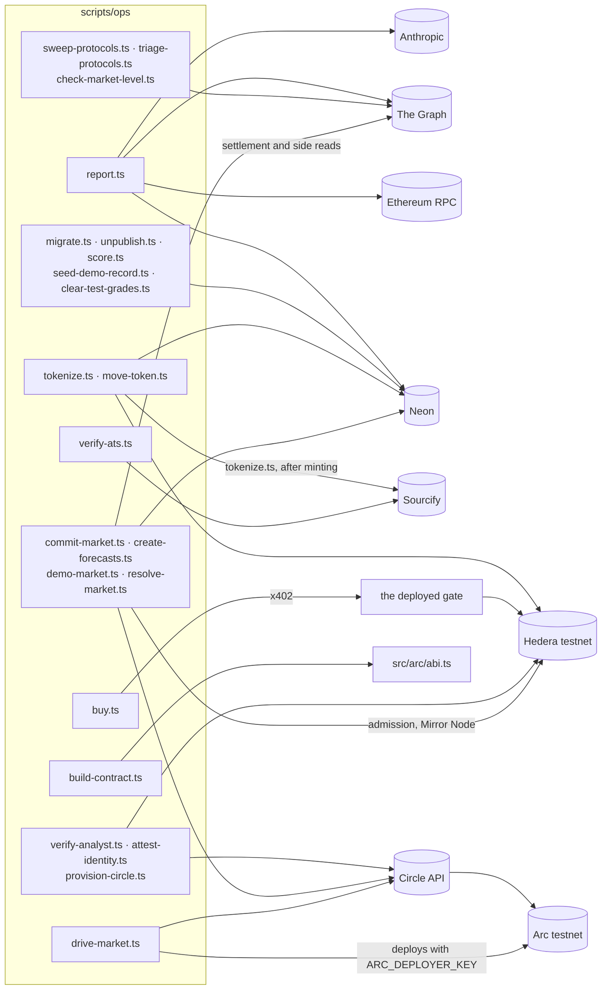

# scripts

Command-line entry points. Run every script as `npx tsx --env-file=.env <path> …`. This needs
Node 20.6 or later, and `.env` must exist, even if it is only a copy of `.env.example`.

| path | what is in it |
|---|---|
| `ask.ts` | Ask the data layer a question in plain English and watch the agent call its tools. Needs only `GRAPH_API_KEY` and `ANTHROPIC_API_KEY`. Stores nothing. |
| `ops/` | Operational tools, run against live services |
| `demo/` | One proof per build unit, kept as a record |
| `smoke/` | Phase 0's nine isolated integration tests |

## What the ops scripts touch

Measured from their imports and the calls those make.

## ops/

⚠️ **Most scripts that spend are dry by default** and print what they would do. The spend flag is
in the table. **Three spend by default:** `commit-market.ts`, `drive-market.ts`, and
`resolve-market.ts --rehearse`.

**Reports and the data layer**

| script | what it does | cost or effect |
|---|---|---|
| `report.ts "<directive>"` | Generate a report and store it | model tokens, Graph queries, Ethereum RPC reads; a database write |
| `sweep-protocols.ts [--inventory]` | Ask every configured deployment whether it answers. `--inventory` rewrites `docs/protocol-inventory.md`. | Graph queries |
| `triage-protocols.ts` | Decide whose numbers are publishable, checked against DefiLlama as a reference. Writes `/tmp/triage.json`. | Graph queries, DefiLlama |
| `check-market-level.ts` | A one-shot comparison, already run | Graph queries |
| `unpublish.ts <hash…> [--apply]` | Take our own test reports off the marketplace | database write with `--apply` |
| `migrate.ts` | Apply `src/store/migrations/` in order, through `DATABASE_URL_DIRECT` | DDL (see `src/store/README.md` on migration 009) |

**Hedera**

| script | what it does | spends |
|---|---|---|
| `tokenize.ts <hash> [--confirm]` | ATS issuance, then Sourcify verification | about 7.7 HBAR |
| `move-token.ts <hash> <0x…> [--confirm]` | Transfer a report token | about 0.43 HBAR |
| `buy.ts <hash> [--confirm]` | The buyer agent pays for one read over x402, against the deployed gate | 0.001 HBAR |
| `verify-ats.ts <address>` or `--all` | Verify report tokens on Sourcify, which HashScan reads | publishes source |

**Arc**

| script | what it does | spends |
|---|---|---|
| `build-contract.ts [--check]` | Compile `contracts/AlphaMarket.sol` into `src/arc/abi.ts`; `--check` compares instead of writing | — |
| `drive-market.ts [--preflight] [--address=0x…]` | Deploy AlphaMarket, with the analyst's Circle wallet as resolver, and drive every path | ⚠️ **USDC by default**; `--preflight` only checks |
| `provision-circle.ts` | Generate or reuse the Circle entity secret and print the ciphertext Circle's console asks for | — |
| `verify-analyst.ts` | Assert `config/analysts.ts` against the live Circle API and Mirror Node | read-only |
| `attest-identity.ts [--check] [--force]` | Sign the two-key identity attestation into `src/arc/attestation.ts`; `--check` verifies only | signing, no gas |
| `commit-market.ts [--dry-run] [--create-only]` | Create a market and commit the analyst's claim; `--create-only` stops after `createMarket`. The day and metric come from `MARKET_OBSERVED_DAY` and `MARKET_METRIC`. ⚠️ The default day, 2026-09-12, is now in the past: set one that has not started before spending. | ⚠️ **USDC by default**; `--create-only` spends gas |
| `create-forecasts.ts [--send]` | Create forecast markets with no claim | gas with `--send` |
| `demo-market.ts --presets / --list / --seed [--send] / --create [--send] [--window=…] [--day=…] / --retire [--send]` | Demo markets: check the presets, list them, open one, or void the abandoned | USDC with `--send`: `--seed` and `--create` also stake 0.01 USDC; `--retire` spends `voidMarket` gas |
| `resolve-market.ts --market=m/… [--send] [--live]` or `--rehearse` | Settle one market, then resolve or void it. Chain markets 6 and 7 also need `--live`. `--rehearse` creates two throwaway markets and resolves one and voids the other. | gas with `--send`; ⚠️ **`--rehearse` spends with no flag** |
| `score.ts [--dry-run] [--market=m/…]` | Grade settled claims | database write |
| `seed-demo-record.ts [--list] [--remove]` | The seeded demo grades, which have no chain market | database write |
| `clear-test-grades.ts [--apply]` | Delete grades that belong to test markets | database write with `--apply` |

## demo/

One proof per build unit, named after the module it proves (`spec.ts` proves `src/arc/spec.ts`, and
so on). Each ran once against live data to show its unit worked. They are kept as a record and are
not maintained.

- ⚠️ `demo/store.ts` deliberately corrupts a stored row to prove `load()` refuses it. Do not run it
  against a database you care about. Use `ops/report.ts` to make reports.
- ⚠️ `demo/skills.ts` is broken: the skill file it reads was moved to `src/agent/skills/unused/`.

## smoke/

Phase 0: nine isolated tests, each proving one external integration against the real service before
anything was built on it. Results are in `tracking/smoke-results.md`, and the index is
`smoke/README.md`. Run one with `npm run smoke:NN`.

⚠️ **Do not run `smoke/08-circle-payable-call.ts`** unless you intend to. It deploys a contract,
sends a payable transaction, and without `CIRCLE_WALLET_ID` set it creates a new Circle wallet.
