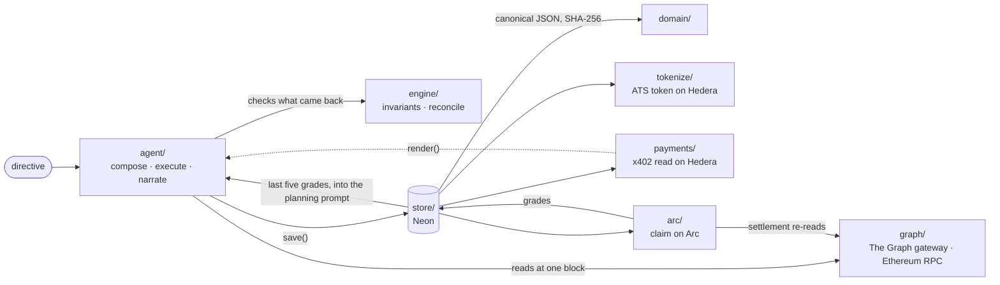
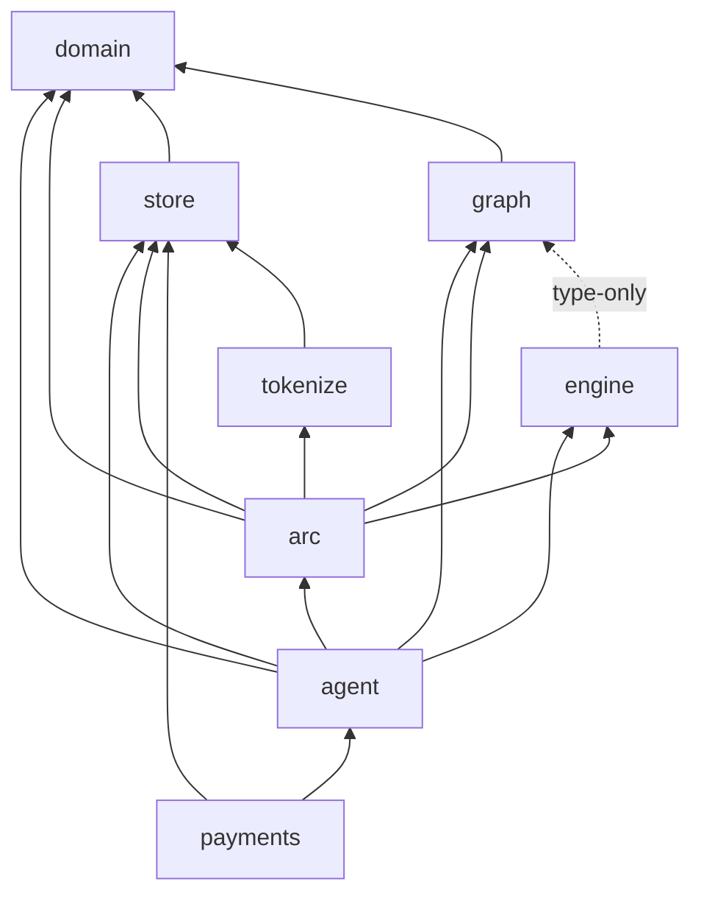

# src — the system

Everything that is not a page, a route or a script. TypeScript as ESM with NodeNext resolution:
imports carry explicit `.js` extensions, and the root `tsconfig.json` type-checks `src/` together
with `scripts/`. Next type-checks `app/` with its own `tsconfig.app.json`.

## Subsystems, in the order a report moves through them

| directory | what it does | answers |
|---|---|---|
| [`config/`](config/README.md) | Measured facts everything reads: 28 lending deployments, the analyst, the price, the model, the env guard | The Graph — standardization |
| [`graph/`](graph/README.md) | Every number enters here: The Graph's gateway, block pinning, pagination, corroboration against Ethereum, trust annotation | The Graph — both tracks |
| [`engine/`](engine/README.md) | Pure checks: invariants, the reconciliation verdict, decimal arithmetic | — |
| [`agent/`](agent/README.md) | Directive → plan → executed draft → narrated report. Also the planning context built from graded claims, and the interactive demo loop. | The Graph — AI tooling |
| [`domain/`](domain/README.md) | The report hash: RFC 8785 canonical JSON → SHA-256. The 32 bytes both chains carry. | — |
| [`types/`](types/README.md) | The published report shape, and internal wire types | — |
| [`store/`](store/README.md) | Neon Postgres: reports, tokens, quotes, purchases, markets, claims, stakes, evidence, scores | — |
| [`tokenize/`](tokenize/README.md) | A stored report becomes an ATS security token on Hedera | Hedera — tokenization |
| [`payments/`](payments/README.md) | The x402 gate and the buyer agent, settled through Blocky402 | Hedera — agentic payments |
| [`arc/`](arc/README.md) | The prediction market: spec, Circle-signed writes, admission, settlement, resolution, scoring | Arc |

## How a report moves through them

`config/` and `types/` are read by nearly everything and are left off.

## Which way the imports point

Measured from the import statements on 2026-09-13 (imports only, not runtime calls). An arrow points
from the importer to what it imports; the dashed one is type-only.

Left off the diagram: `config`, which every subsystem except `domain` and `types` imports, and
`types`, which every subsystem except `payments` imports. `types` imports nothing, and `config` has
one type-only import from `types`. Three edges exist for one thing each: `agent` → `arc` for the
rehearsal rule (`context.ts`), `payments` → `agent` for `render()` (`gate.ts`), and `arc` →
`tokenize` for the Mirror Node helpers (`admission.ts`).

**Tokenize and payments never import `arc`, and `arc` never imports `payments`.** Hedera and Arc
meet only in the report hash, never in code that calls across.
