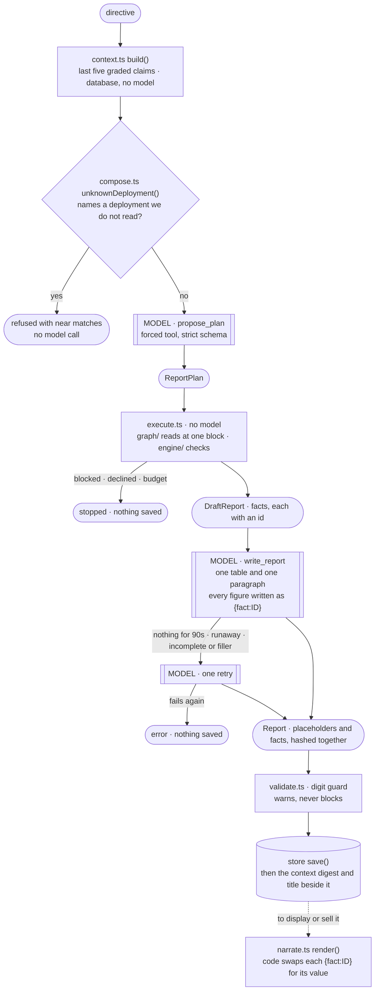

# agent — directive in, report out

**Answers: The Graph — AI tooling.** A plain-English directive becomes a report in which every
figure traces to a Graph query at a named block. Two model calls, with deterministic code between
them, do the work.

| file | what it does | model calls |
|---|---|---|
| `context.ts` | Builds the planning context from the analyst's last five settled, graded claims (rehearsals and past-posted markets excluded), one line each. A digest of what the planner saw is stored beside the report as `context_digest`, outside the hash. | 0 |
| `compose.ts` | First, `unknownDeployment()` refuses a directive naming a deployment this platform does not read — a near-miss spelling, a version nothing is configured at, or a deployment that is not answering — and lists live near matches. Otherwise directive plus context becomes a `ReportPlan`: which deployments, which documents, which metric. Picks from the document registry, never writes GraphQL, reads no data. | 1, or 0 when refused |
| `execute.ts` | Runs the plan. Finds one block the whole set can share or refuses; fetches, runs the engine's checks and corroboration, and assembles the `Report`. Needs `ETHEREUM_RPC_URL` for the block's timestamp. | 0 |
| `narrate.ts` | Draft becomes one table and one paragraph, written in `{fact:ID}` placeholders; `render()` substitutes the values when the report is displayed or sold. The stream is watched while it runs (below). | 1, and a second only on retry |
| `validate.ts` | The digit guard: flags a digit typed outside a placeholder, a placeholder or basis id that names no fact, and an invalid confidence. ⚠️ **It warns; it does not block.** | 0 |
| `loop.ts`, `tools.ts` | The interactive agent behind `scripts/ask.ts` (and three `scripts/demo/` proofs): a tool loop over `run_document` and `get_capabilities`. **Not on the report path.** | one per turn |
| `skills/` | Prompt material. `report.md` shapes the narrator; `conventions.md` is loaded by both compose and narrate; `skills/unused/` is parked. | — |

**Entry points:** `scripts/ops/report.ts "<directive>"` on the command line, and
`POST /api/console/generate`, which streams each stage to `/console`. Both run context → compose →
execute → narrate → validate → save.

## Why a figure is hard to invent, and what still gets through

The narrator is handed a fact table and told to write every figure as `{fact:ID}`; code fills in the
values. A number the data layer did not fetch has no id, so there is no placeholder for it.

⚠️ **That does not make a typed number impossible.** `table` and `summary` are free strings, so the
model can still type a digit. The digit guard flags it and only warns, and every caller saves the
report anyway: the report saved on 2026-09-13 by the compound-v3 proof run carried seven warnings.

## Narration failures are caught, not saved

- **The API sends each part of the tool call only once it is complete**, so a healthy stream goes
  quiet for as long as the table or the assessment takes to write — up to 46 seconds measured on a
  152-fact report. An attempt that delivers nothing for 90 seconds is aborted.
- A visible runaway (a long whitespace run, or an oversized title or summary) is also aborted, but
  only once that value has arrived.
- A summary under 200 characters is rejected as filler.
- A failed attempt is retried once. A second failure is an error, and nothing is saved.

⚠️ This catches the narrator's intermittent failure at the assessment. It does not cure it.

## The feedback loop is text, not training

No weights change. `context.ts` puts a few hundred characters describing recent graded claims into
the planning prompt, rebuilt from the database for each report. The model sees *what* it got wrong,
not *why*. A voided market is shown as `VOID (no outcome)`, never as a wrong call. `/analyst` shows
the block verbatim.
