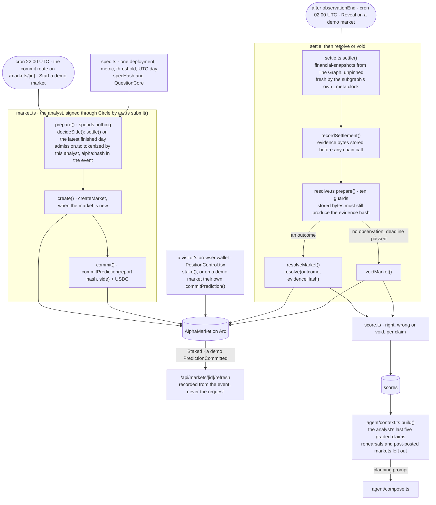

# arc — the prediction market

**Answers: Arc.** Everything the analyst does on Arc testnet:
1. define a question and create a market;
2. commit a report to a side with its own USDC;
3. settle by re-reading The Graph;
4. resolve or void on chain;
5. grade the result.

The contract is `contracts/AlphaMarket.sol`.

The analyst's Arc account is a **Circle developer-controlled wallet**
(`@circle-fin/developer-controlled-wallets`). Every analyst write on Arc goes through Circle's API,
and no Arc private key for the analyst exists in this repo or its environment.

## Files

| file | what it does | spends on Arc |
|---|---|---|
| `spec.ts` | What a market asks: one deployment, one metric, above or below a threshold, on one UTC day. Pure. Produces `specHash` and the on-chain `QuestionCore`. | no |
| `arc.ts` | Plumbing for every Arc write. `submit()` calls Circle's `createContractExecutionTransaction` with an idempotency key and waits for a transaction hash. Also holds the analyst's identity and the 6-dp to 18-dp USDC conversion. | via its callers |
| `abi.ts` | **Generated** by `scripts/ops/build-contract.ts`. ⚠️ Server-only: it carries the full bytecode. | — |
| `admission.ts` | Before a commit: is this report tokenized on Hedera, by this analyst, with `alpha:<hash>` in the creation event? Checked against Mirror Node. | no |
| `market.ts` | `prepare()` runs every refusal and spends nothing; `create()` and `commit()` spend. `decideSide()` picks the analyst's side from The Graph's latest finished daily snapshot. | create, commit |
| `settle.ts` | The settlement read. Fetches the observed day's snapshot from The Graph, checks freshness against the subgraph's own `_meta` timestamp, and stores the evidence before anything goes on chain. | no |
| `resolve.ts` | `prepare()` checks the contract's guards off-chain, including that this analyst is the contract's resolver. Then `resolveMarket()` with the stored evidence hash, or `voidMarket()`. | resolve, void |
| `score.ts` | Grades settled claims: forecast right, wrong or void; reconciliation quality copied from the report; trading return. | no (database only) |
| `rehearsal.ts` | The rule for which markets count. One created after its observed day ended is a *rehearsal*; one whose staking closed inside or after that day is *past-posted*. Neither counts toward the analyst's record. | no |
| `identity.ts`, `attestation.ts` | One sentence signed by both analyst keys (Circle on Arc, the Hedera key), so anyone can recover both addresses and see that one analyst holds them. Verification, not enforcement. | no |

## What drives it

| trigger | entry point | what happens |
|---|---|---|
| daily, 22:00 UTC | `app/api/cron/commit/route.ts` | commit on markets directed at the analyst that have no claim yet |
| daily, 02:00 UTC | `app/api/cron/resolve/route.ts` | settle, then resolve or void, then grade |
| a visitor on `/markets/[id]` with no claim yet | `app/api/markets/[id]/commit/route.ts` | the analyst commits the chosen report. Two presses: a plan, then the spend. |
| a visitor's browser wallet | `app/markets/[id]/PositionControl.tsx`, then `/api/markets/[id]/refresh` | stake from MetaMask, or on a demo market commit the visitor's own claim. Recorded from the chain's event. |
| Start and Reveal on the markets pages | `app/markets/actions.ts` | open a demo market; settle and resolve one |
| an operator | `scripts/ops/commit-market.ts`, `create-forecasts.ts`, `resolve-market.ts`, `score.ts`, `demo-market.ts`, `drive-market.ts` | the same functions, by hand |

## Limits, stated

- ⚠️ **No cron-sent transaction has been evidenced.** Both crons are deployed and scheduled. Every
  Arc transaction so far was started by a command or a button press, then signed by the Circle
  wallet with no human signing.
- **Trading return is null.** Nothing records the contract's `Claimed` events, so nothing on a
  production path writes `payouts` (only the fixture proof `scripts/demo/score.ts` inserts rows). The
  site has no claim button; stakers call `claim()` on the contract directly.
- **Reconciliation quality is null on every report so far**, so it grades nothing yet.
- **No spend cap.** The Circle wallet-set cap was never set, and `spend_ledger` has no writer.
- **The resolver is immutable.** A second analyst needs its own contract deployment.
