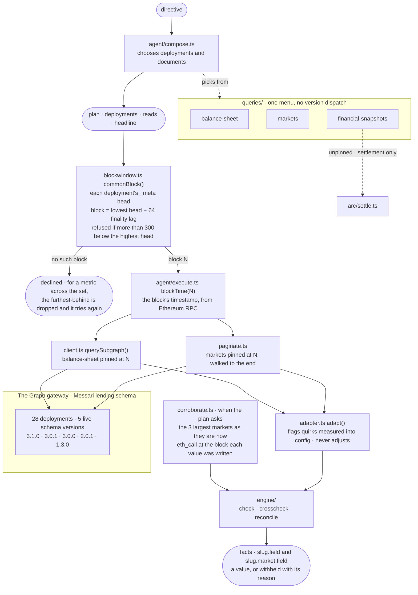

# graph — the data layer

**Answers: The Graph, both tracks.** Every number in the system enters here. It reads
Messari-standardized lending subgraphs through The Graph's gateway
(`https://gateway.thegraph.com/api/<GRAPH_API_KEY>/subgraphs/id/<subgraph id>`). Then it decides how
far each figure can be trusted before anything downstream sees it. **Nothing is cached:** every
figure in a report traces to a query that actually ran.

| file | what it does |
|---|---|
| `client.ts` | Queries one deployment or many, optionally pinned to a block. Turns gateway failures into typed decisions: a pruned block and a lagging indexer return the same message, and the difference is arithmetic inside it. Used by the report pipeline, the agent's tools, the console's source panel and market settlement. |
| `queries/` | The document menu: `balance-sheet`, `markets`, `financial-snapshots`. The planner picks documents and supplies variables. **It never writes GraphQL.** A report turns `balance-sheet` and `markets` into facts. `financial-snapshots` is read only by market settlement; a report plan that names it gets a check saying its rows were not turned into facts. |
| `blockwindow.ts` | One block every deployment in a set can answer at, or a refusal. Comparing two moments is worse than declining. |
| `paginate.ts` | Walks a population to the end and says honestly whether it finished |
| `adapter.ts` | The trust layer. It annotates figures that cannot be trusted and never adjusts them. |
| `corroborate.ts` | Samples a deployment's three largest markets as they stand now, reads Ethereum (archive RPC) at the block where the subgraph last wrote each value, and compares exactly. Runs only when the plan asks for chain corroboration and config names a contract accessor. |
| `evidence.ts` | A hashable record of one query, used by market settlement (`src/arc/settle.ts`) and the console's source panel |

## The standardized schema, and what it made easier

All 28 configured deployments publish Messari's lending schema, across five versions that are live
today: 3.1.0, 3.0.1, 3.0.0, 2.0.1 and 1.3.0.

- **One document per question, and no version dispatch.** The documents request fields that were
  measured, by schema introspection, to exist in all five versions. Nothing in the query layer
  branches on version.
- **A new deployment is a config row.** It needs no new query and no adapter change
  (`src/config/protocols.ts`).
- **Comparisons at one block.** Every deployment answers the same document, so `blockwindow.ts` can
  pin a set to a common block and a report can rank them side by side.
- **Markets on any deployment.** Settlement re-reads `financial-snapshots` for whichever deployment
  a market names. The contract and the settlement read carry no per-protocol code.

⚠️ **A shared schema is not a shared meaning.** Morpho Blue uses the standard field names for
different quantities. aave-v3 and spark-lend carry a revenue accumulator broken by a template fault.
That is why `adapter.ts` exists, and why each deployment's quirks are measured into
`config/protocols.ts` rather than assumed.

**Reproduce:**
- `scripts/ops/sweep-protocols.ts --inventory` shows who answers.
- `scripts/demo/documents.ts` runs every document against one deployment per schema version.
- `scripts/demo/corroborate.ts` compares subgraph figures against the chain.
