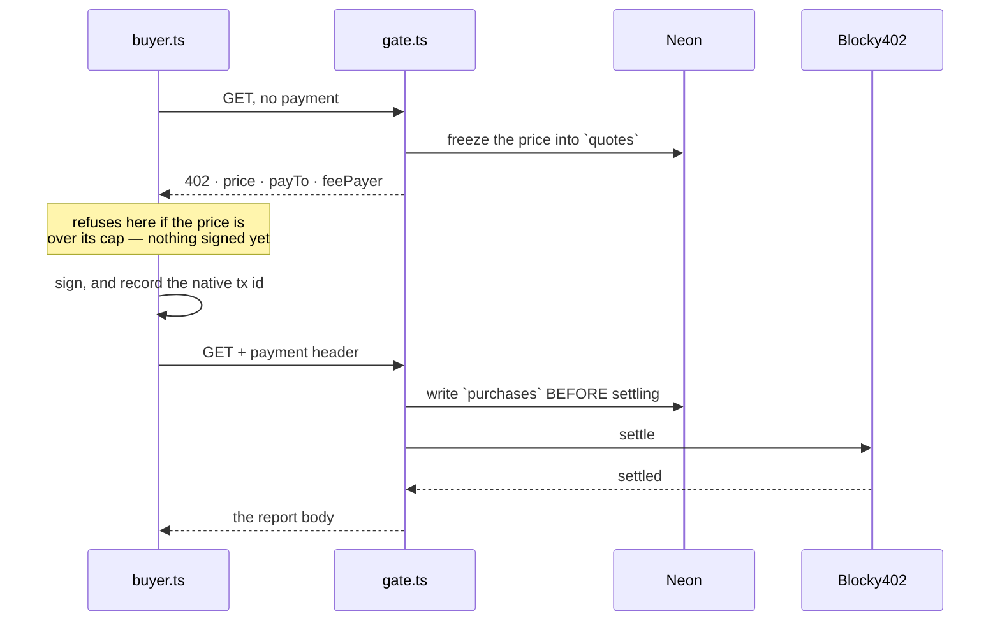

# payments — the body already exists before anyone pays for it

An x402 paywall on Hedera testnet, settled through the Blocky402 facilitator. One report costs
0.001 HBAR.

⚠️ **The gated handler only ever reads an already-persisted report, and that is the load-bearing
decision in this directory.** A Hedera payment has a validity window of roughly 120 seconds. If the
handler *generated* a report — a minute of model calls and subgraph reads — that window would be on
the critical path, and "charged with nothing delivered" becomes reachable. Reports are generated by
the CLI and stored; the gate only ever hands one over.

## Four rules that are not obvious

1. **Quote before work.** The price is frozen into a row before the challenge goes out, so a
   settlement can be matched back to what it was for. A live quote is reused rather than duplicated,
   or anything crawling the public index would grow that table without bound.
2. **The `authorization` flow, never `paymentProxy`.** A handler that throws means settle never runs
   and nobody is charged. There is no refund primitive on Hedera — or any chain — today, so
   failure-avoidance is the only remedy that exists.
3. **The native transaction id is written before settle is called.** Every Hedera settle failure
   returns `{success: false, transaction: ""}` — *including a timeout after the transaction was
   already broadcast*. Recovering the id from bytes we already hold is the only thing left to
   reconcile against afterwards. If that row cannot be written, settlement is aborted rather than
   attempted: an unrecorded charge is worse than an uncharged reader.
4. **`payTo` comes from the report's own analyst row**, never from an environment variable, so a
   second analyst's sales cannot pay the first.

## What is deliberate, and what is simply not built

**Deliberate:** x402 here is **agent-to-agent**. `buyer.ts` is an agent with its own wallet and its
own spend caps that decides, unattended, whether a quoted price is worth paying. A human in a browser
cannot pay — the x402 paywall package ships EVM, Solana and Aptos flavours and **no Hedera export**,
so a browser payment would need a WalletConnect Hedera signer built from scratch. That is a decision
with a cost attached, not a gap.

**Not built:** ambiguous-settlement recovery and the payment-identifier response cache. Today a
buyer whose settle times out after broadcast holds a native transaction id and nothing reconciles it.
⚠️ **And one paid read grants no durable access** — there is no re-read by address, `delivered_at` is
never written, and a lost response is not recoverable. Human *identity* — proving which address
someone controls — is the declared cut point and does not exist either.
