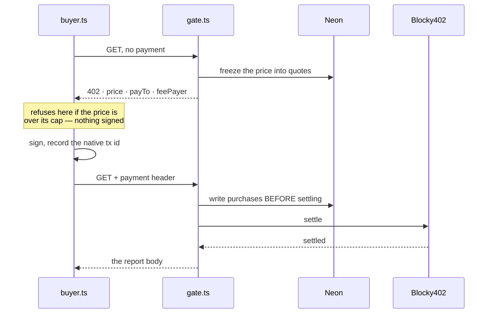

# payments — x402 on Hedera, agent to agent

**Answers: Hedera — agentic payments.** A report's full body sells for 0.001 HBAR (100,000 tinybars,
set in `config/pricing.ts`) behind an x402 gate on Hedera testnet, settled through the Blocky402
facilitator. The buyer is an agent with its own Hedera account and its own spend caps.

| file | what it does |
|---|---|
| `server.ts` | The x402 resource server: network `hedera:testnet`, facilitator `https://api.testnet.blocky402.com`, fee payer `0.0.7162784` |
| `quotes.ts` | Freezes the price into a `quotes` row before the 402 goes out. A live quote is reused. |
| `gate.ts` | `withX402` in the default `authorization` flow: unpaid gets a 402, paid gets the report. Writes `purchases` before settling. `payTo` comes from the report's analyst row. |
| `buyer.ts` | The paying agent. It reads the 402 and refuses a price above its caps, or an asset it has not allowlisted, before signing anything. Then it signs a Hedera transfer, records the native transaction id, and retries with the payment header. |

| role | where |
|---|---|
| the gated service | `GET /api/reports/[hash]` on the deployed app (`app/api/reports/[hash]/route.ts`) |
| the consumer | `scripts/ops/buy.ts <hash> --confirm`, and `POST /api/buy`. The "Buy this read" button on every report page calls `/api/buy`, which runs the same `buy()` on the server. |

## Four rules that are not obvious

1. **Quote before work.** The price is fixed in a row before the challenge goes out, so a
   settlement can be matched to what it paid for.
2. **The `authorization` flow, never `paymentProxy`.** If the handler throws, settle never runs and
   nobody is charged. Hedera has no refund primitive, so avoiding a bad charge is the only remedy.
3. **The native transaction id is written before settle is called.** A Hedera settle that times out
   after broadcast fails the same way as one that never broadcast, so the id is the only thing left
   to reconcile against. If that row cannot be written, settlement is aborted.
4. **`payTo` comes from the report's own analyst row**, never from an environment variable.

## Limits, stated

- **A human in a browser cannot pay.** `@x402` ships no Hedera paywall. Pressing "Buy this read"
  spends our buyer account's HBAR, not the visitor's.
- **Every settled purchase so far came from our own buyer**, account `0.0.10387696`. There have been
  16 as of 2026-09-13.
- **HBAR, not USDC**, on testnet.
- **`/api/buy` is unauthenticated.** Its caps bound it: 0.01 HBAR per payment, and 0.05 HBAR per day
  per warm server instance.
- ⚠️ **An unpaid door to the same body.** While the console lock is unwired (since 2026-09-12),
  `POST /api/console/report` returns a report's rendered body from the store without payment. The
  x402 gate itself is unchanged.
- **Not built:**
  - recovery of an ambiguous settlement;
  - durable access (a paid read is one response, and `delivered_at` is never written);
  - human identity, which was the declared cut point.
