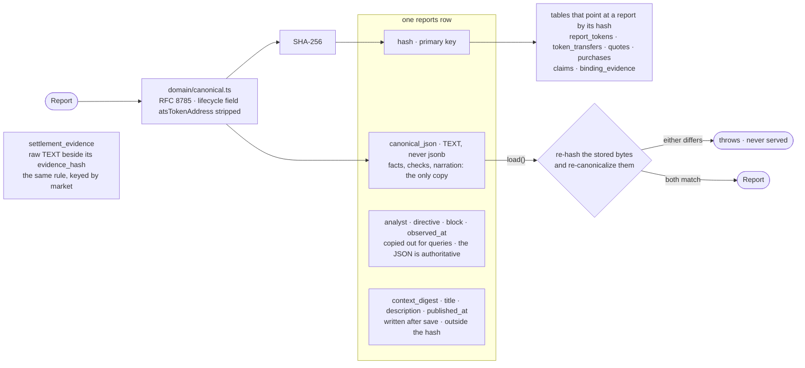

# store — the only copy

Neon Postgres, through the `postgres` client with no ORM. A report's narration is inside its hash,
and the model call that wrote it is not deterministic, so **a lost report cannot be regenerated.**
This directory is the only place a report exists.

| file | what it holds |
|---|---|
| `db.ts` | The two connections. `DATABASE_URL` is Neon's **pooled** endpoint, for request paths. `DATABASE_URL_DIRECT` is the **direct** endpoint, for migrations only. Clients are created lazily, so a missing variable fails the request that needs it rather than every cold start. |
| `reports.ts` | `save`, `load`, `list`, `listPublished`, `publish`, `unpublish`, and the title and description writes. The canonical JSON is stored as TEXT, never jsonb, because jsonb reorders keys and normalises numbers. `load` re-derives the hash and re-canonicalizes the stored bytes, and throws if either no longer matches. |
| `tokens.ts` | Which report has an ATS token, and where it lives |
| `markets.ts` | Row shapes and reads for markets, claims, stakes, settlement evidence, payouts and spend |
| `outstanding.ts` | The two "what work is outstanding now" queries the crons ask: markets awaiting a commit, and markets awaiting resolution |
| `migrations/` | `001` to `010`, applied in filename order by `scripts/ops/migrate.ts` through the direct URL |

## Tables

| group | tables |
|---|---|
| reports | `reports`, `report_tokens`, `token_transfers` |
| payments | `quotes`, `purchases` |
| markets | `markets`, `claims`, `stakes`, `settlement_evidence`, `binding_evidence`, `scores`, `payouts`, `spend_ledger` |

## Unfinished, stated

- **`payouts` and `spend_ledger` have no writer** in `src/` or `app/`. As a result, trading return
  is null for every claim, and nothing records what the analyst spends.
- `quotes.state` is never written, so every row reads `open` and liveness comes from `expires_at`.
  `purchases.delivered_at` is never written either.
- ⚠️ **Re-running the migrations is not a pure no-op on a database that has used `unpublish()`.**
  `009_report_published.sql` backfills `published_at` for reports created on or before
  2026-09-12 18:42 UTC that have a token, a settled purchase or a claim. It cannot tell a report
  that was never listed from one that was deliberately unlisted. On a fresh database this never
  matters.
- `001_init.sql` creates a column that `002` drops. That is deliberate: a migration that has already
  run is history.
