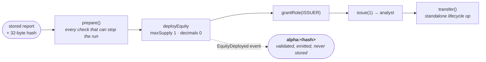

# tokenize — the report's hash, committed on a public chain

A published report becomes a security token on Hedera testnet, issued through Asset Tokenization
Studio contracts. **The interesting part is not that it is a token — it is what the token carries.**

At deploy time the equity struct's `additionalSecurityData.info` is set to `alpha:<report hash>`, and
that string is emitted in the `EquityDeployed` event. So the same 32 bytes that are the report's
primary key in Postgres, and that an Arc market will settle against, are readable on Hedera by
anyone with an indexer. That is the cross-chain commitment, and it is one field.

## The two-phase split is a safety property, not a style

`prepare()` does every read-only check — is this report already tokenized, is the public factory
alive, does the signing key derive the analyst's own address, is there balance — and `tokenize()` is
the only thing that spends. A deploy that reverts costs about a million gas and produces nothing, so
everything that can stop the run stops it **before** the first transaction rather than between the
second and the third. `transfer.ts` follows the same shape.

⚠️ **Nothing retries.** A blind retry after a partial run deploys a second asset with nothing on
chain to say which one was ours, so every write states what already landed and then stops.

## Things a reviewer should not have to discover

- **The hash is event-only.** `additionalSecurityData` is validated and emitted, never written to
  contract storage. Reading it back out of the log is the only proof it survived — which is fine with
  an indexer and awkward without one.
- **A transfer is demonstrated, and it is not caused by a payment.** The Own tier is cut: a buyer
  pays to *read*, and no token moves to them. The requirement asks for issuance, configuration and at
  least one lifecycle operation — not for that operation to be caused by a purchase.
- **The factory and resolver are public infrastructure nobody here deployed.** `prepare()` re-checks
  they are alive on every run, and `/api/health` reports the resolver's expiry so the assumption is
  visible rather than filed in a decision record.
- **Verification is not automatic everywhere.** `scripts/ops/tokenize.ts` verifies on Sourcify as its
  final step, but a token minted through the browser console cannot — the compiler is a
  devDependency and is not present in a serverless function. `verify-ats.ts --all` sweeps those.

`hedera.ts` holds the plumbing every chain write shares — revert reasons (which on this relay exist
only on Mirror Node), balance reads that wait for consensus, and the one Mirror Node host.
`isin.ts` derives each token's ISO 6166 identifier from the report hash; its check digit is validated
**on chain**, so a wrong one would revert a deploy that has already been paid for.
