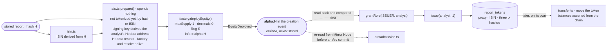

# tokenize — the report hash, issued as a security on Hedera

**Answers: Hedera — tokenization.** A stored report becomes an equity security token on Hedera
testnet. It is issued through Asset Tokenization Studio's contracts
(`@hashgraph/asset-tokenization-contracts` 8.0.0) against ATS's public testnet factory
(`0.0.9213391`) and resolver (`0.0.9212226`), driven with `ethers` over the Hedera JSON-RPC relay.

| file | what it does |
|---|---|
| `ats.ts` | `prepare()` runs every check that can stop a run and spends nothing. `tokenize()` deploys, grants ISSUER, issues one token to the analyst, and records it. |
| `transfer.ts` | The lifecycle operation: move a report token, with balances asserted from the chain before and after |
| `isin.ts` | The token's ISIN, derived from the report hash. The ATS factory validates the check digit on chain, so it is proved here first. |
| `hedera.ts` | Shared plumbing: revert reasons from Mirror Node, and balance reads that wait for consensus |

## Issuance, configuration, lifecycle

| step | what happens | where |
|---|---|---|
| configure and deploy | `deployEquity` with `maxSupply 1`, `decimals 0`, name "Alpha Markets Report", symbol `ALPHA`, an ISIN derived from the hash, Reg S, no compliance contract or identity registry, controllable, and `additionalSecurityData.info = "alpha:<report hash>"` emitted in the creation event | `ats.ts` → `equityData()` |
| grant | `grantRole(ISSUER)` to the analyst's Hedera EVM address | `ats.ts` |
| issue | `issue(analyst, 1)` | `ats.ts` |
| lifecycle | `transfer(to, 1)`, signed by either the analyst or the buyer account | `transfer.ts` |

**Run it:**
- `scripts/ops/tokenize.ts <hash>` prints the plan. Add `--confirm` to spend about 7.7 HBAR; it then
  verifies the token on Sourcify.
- `scripts/ops/move-token.ts <hash> <to> --confirm` transfers a token.
- The Tokenize section of `/console` uses `POST /api/console/tokenize`.

## Things a reviewer should not have to discover

- **The hash is in the event, not in storage.** To check a token, fetch its deploy transaction from
  Mirror Node (`/api/v1/contracts/results/<deploy tx>`) and find the hex of `alpha:` followed by the
  report hash in the logs.
- **The analyst comes from the report.** `prepare()` matches `Report.analyst` to a row in
  `config/analysts.ts`, and refuses a signing key that does not derive that row's Hedera address. A
  fork must put its own accounts in that file before generating reports it wants to tokenize.
- **The transfer stands on its own.** A purchase buys a read, not the token.
- ⚠️ **Sourcify verification covers 4 of 11 tokens.** The four minted on 2026-09-08 and 09 are
  `exact_match`. The seven minted since 2026-09-12 are not verified: the console's tokenize route
  has no compiler, and `scripts/ops/verify-ats.ts --all`, which sweeps them, has not been run since.
- **The factory and resolver are third-party infrastructure.** `/api/health` reports the resolver
  account's Hedera expiry of 2026-09-10 (it is now in its grace period). Tokenization still succeeded
  on 2026-09-13.
